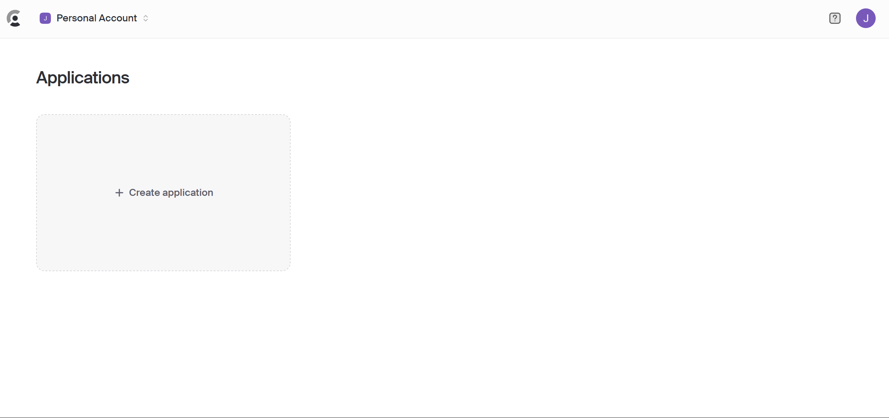
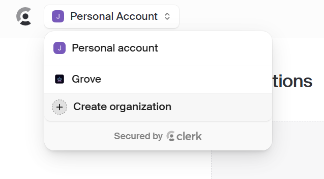
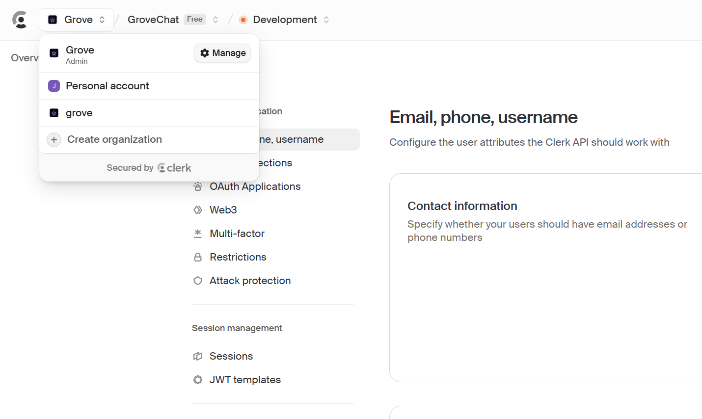

<div align="center">

[إنجليزي](./README.en.md)\|[الصينية المبسطة](./README.zh-CN.md)\|[العربية](./README.ar.md)\|[فرنسي](./README.fr.md)\|[اليابانية](./README.ja.md)

</div>
<div align="center">
  <h1>GroveChat</h1>
  <a href='#企業版'>
    
  </a>

  <p>一鍵免費部署你的私人 ChatGPT 網頁應用，支持 GPT3、GPT4 和 Gemini Pro 模型。</p>

  <p>
    <a href="https://grove-chat.vercel.app">GroveChat</a> / 
    <a href="https://grove-chat.vercel.app">企業版</a> / 
    <a href="https://grove-chat.vercel.app">演示 Demo</a> / 
    <a href="https://github.com/robbiedood/grove-chat/issues">反饋 Issues</a>
  </p>

  <a href="https://vercel.com/new/clone?repository-url=https://github.com/robbiedood/grove-chat&env=OPENAI_API_KEY&env=CLERK_SECRET_KEY&env=CLERK_WEBHOOK_SECRET&env=NEXT_PUBLIC_CLERK_PUBLISHABLE_KEY&project-name=grove-chat&repository-name=grove-chat">
    
  </a>
</div>

## جدول المحتويات

-   [إصدار المؤسسة](#企業版)
-   [سمات](#功能特點)
-   [ابدأ](#開始使用)
-   [تكوين كلمة مرور الوصول إلى الصفحة](#配置頁面訪問密碼)
-   [متغيرات البيئة](#環境變量)
-   [إعدادات نموذج المستخدم](#用戶模型設置)
-   [التنمية المحلية](#開發)
-   [لقطة شاشة](#截圖)
-   [المشاريع ذات الصلة](#相關項目)
-   [اتفاقية مفتوحة المصدر](#開源協議)
-   [تغيير الوصف](./CHANGELOG.md)

## إصدار المؤسسة

تلبية احتياجات النشر والتخصيص الخاصة بشركتك

-   **تخصيص العلامة التجارية**: واجهة المستخدم/واجهة المستخدم (VI/UI) المصممة خصيصًا للمؤسسات، والتي تتوافق بسلاسة مع صورة العلامة التجارية للشركة
-   **تكامل الموارد**: يتم تكوين العشرات من موارد الذكاء الاصطناعي وإدارتها بشكل موحد من قبل مديري المؤسسات، ويمكن لأعضاء الفريق استخدامها خارج الصندوق
-   **إدارة الأذونات**: أذونات الأعضاء، وأذونات الموارد، وأذونات قاعدة المعرفة هي تسلسل هرمي واضح وموحد يتم التحكم فيه بواسطة لوحة الإدارة على مستوى المؤسسة
-   **الوصول إلى المعرفة**: يعد الجمع بين قاعدة المعرفة الداخلية للمؤسسة وقدرات الذكاء الاصطناعي أقرب إلى احتياجات الأعمال الخاصة بالمؤسسة من الذكاء الاصطناعي العام.
-   **التدقيق الأمني**: اعتراض الأسئلة الحساسة تلقائيًا ودعم تتبع جميع سجلات المحادثات التاريخية، مما يسمح للذكاء الاصطناعي بالامتثال أيضًا للوائح أمن معلومات الشركة.
-   **النشر الخاص**: النشر الخاص على مستوى المؤسسة، ودعم العديد من عمليات نشر السحابة الخاصة السائدة لضمان أمان البيانات وحماية الخصوصية
-   **تحديثات مستمرة**: توفير خدمات التحديث والارتقاء المستمر للقدرات المتطورة مثل الوسائط المتعددة والذكاء، والتي يتم استخدامها بشكل متكرر والمتقدمة باستمرار.

استشارة حول إصدار المؤسسة:**فارغ**


## سمات

-   يمكنك النشر على Vercel مجانًا بنقرة واحدة ويستغرق أقل من دقيقة واحدة
-   عميل مبسط (~5 ميجابايت) لنظام التشغيل Linux/Windows/MacOS، قم بالتنزيل الآن
-   متوافق تمامًا مع LLM ذاتية النشر، ويوصى باستخدامه مع RWKV-Runner أو LocalAI
-   الخصوصية أولاً، يتم تخزين جميع البيانات محليًا في المتصفح
-   دعم تخفيض السعر: LaTex، حورية البحر، تسليط الضوء على التعليمات البرمجية، إلخ.
-   تصميم سريع الاستجابة، يدعم الوضع المظلم وPWA
-   يتم تحميل الشاشة الأولى بسرعة (حوالي 100 كيلو بايت) وتدعم استجابة البث
-   v2 新功能：使用提示模板（mask）創建、分享和調試你的聊天工具
-   ضغط سجل الدردشة تلقائيًا لدعم المحادثات الطويلة مع حفظ الرموز المميزة الخاصة بك
-   دعم متعدد اللغات: الإنجليزية والصينية المبسطة والصينية التقليدية واليابانية والفرنسية والإسبانية والإيطالية والتركية والألمانية والفيتنامية والروسية والتشيكية والكورية والإندونيسية

## ابدأ

1.  احصل على استعداد لك[مفتاح واجهة برمجة تطبيقات OpenAI](https://platform.openai.com/account/api-keys);
2.  استخدام Clerk كإدارة أذونات المستخدم[الموقع الرسمي للكاتب](https://clerk.com/)[ملف التكوين](#配置頁面訪問密碼)
3.  انقر فوق الزر الموجود على اليمين لبدء النشر:[](https://vercel.com/new/clone?repository-url=https://github.com/robbiedood/grove-chat&env=OPENAI_API_KEY&env=CLERK_SECRET_KEY&env=CLERK_WEBHOOK_SECRET&env=NEXT_PUBLIC_CLERK_PUBLISHABLE_KEY&project-name=grove-chat&repository-name=grove-chat)، ما عليك سوى تسجيل الدخول مباشرة باستخدام حساب GitHub الخاص بك، وتذكر ملء مفتاح API و[إدارة حقوق المستخدم](#配置訪問權限Clerk)موظف؛
4.  بعد اكتمال النشر، يمكنك البدء في استخدامه؛
5.  (خياري)[ربط اسم المجال المخصص](https://vercel.com/docs/concepts/projects/domains/add-a-domain): اسم المجال DNS المخصص بواسطة Vercel ملوث في بعض المناطق. قم بربط اسم المجال المخصص للاتصال مباشرة.

<div align="center">
   


</div>

## تكوين كلمة مرور الوصول إلى الصفحة

> لقد تخلى هذا المشروع عن متغير البيئة CODE الخاص بالمشروع الأصلي NextChat ويستخدم كلمة مرور الوصول إلى صفحة إدارة Clerk.
>
> ### الخطوة 1: قم بالتسجيل للحصول على حساب كاتب
>
> اذهب الى[الموقع الرسمي للكاتب](https://clerk.com/)، قم بتسجيل حساب وتسجيل الدخول. بعد تسجيل الدخول اضغط**إنشاء التطبيق**（建立應用程式）。



### الخطوة 2: حدد خيار تسجيل الدخول

يُمكَِن**بريد إلكتروني**(مطلوب) و**جوجل**(اختياري) كما هو موضح أدناه.


### الخطوة 3: الحصول على مفتاح API

العثور على الخاص بك`NEXT_PUBLIC_CLERK_PUBLISHABLE_KEY`و`CLERK_SECRET_KEY`. أضفهم إلى`.env`الملف كما هو موضح أدناه:

```env
NEXT_PUBLIC_CLERK_PUBLISHABLE_KEY=你的公開金鑰
CLERK_SECRET_KEY=你的密鑰
```


### الخطوة 4: تكوين البريد الإلكتروني وكلمة المرور

اذهب الى**تكوين > البريد الإلكتروني، الهاتف، اسم المستخدم**(التكوين > البريد الإلكتروني، الهاتف، اسم المستخدم)، تأكد من تمكينه**بريد إلكتروني**(بريد إلكتروني)،**كلمة المرور**(كلمة المرور) و**رمز التحقق من البريد الإلكتروني**(رمز التحقق من البريد الإلكتروني).


### الخطوة 5: تكوين الأدوار والأذونات

قم بتعيين الأدوار والأذونات كما هو موضح في الشكل أدناه:


### الخطوة 6: الإعدادات العامة

اذهب الى**تكوين > الإعدادات**(التكوين > الإعدادات) وقم بضبط الخيارات كما هو موضح أدناه:


### الخطوة 7: تكوين Webhooks

قم بتعيين نقطة نهاية webhook على عنوان URL الخاص بالاستماع. انقر**سر التوقيع**（簽名密鑰）查看你的 `CLERK_WEBHOOK_SECRET`، وإضافته إلى`.env`في الأرشيف:

```env
CLERK_WEBHOOK_SECRET=你的webhook密鑰
```


### 步驟 8：建立使用者

إنشاء حسابات المستخدمين حسب الحاجة.


### الخطوة 9: بناء منظمة

قم بإعداد مؤسسة وأضف عنوان البريد الإلكتروني للمطور. حدد دورهم ل**مدرس**(مدرس).

## إدارة تطبيقات Grove متعددة المسؤولين

### الخطوة 1: بناء منظمة

انقر على الزاوية اليسرى العليا**إنشاء منظمة**(بناء منظمة).

### الخطوة 2: نقل الملكية

اذهب الى**تكوين > الإعدادات**(التكوين > الإعدادات)، انقر فوق**نقل الملكية**(نقل الملكية). قم بتعيين المالك الجديد للمؤسسة التي أنشأتها للتو.


### الخطوة 3: إضافة مستخدمين إضافيين

انقر على الزاوية اليسرى العليا**يدير**(المسؤول) لإضافة مستخدمين إضافيين ومنحهم حق الوصول الإداري.


## متغيرات البيئة

> يتم تعيين معظم عناصر التكوين في هذا المشروع من خلال متغيرات البيئة:[كيفية تعديل متغيرات البيئة فيرسل](./docs/vercel-cn.md)。

### `OPENAI_API_KEY`(مطلوب)

مفتاح OpenAI، مفتاح واجهة برمجة التطبيقات الذي تقدمت للحصول عليه في صفحة حساب openai، استخدم الفواصل الإنجليزية لفصل المفاتيح المتعددة، بحيث يمكن استقصاء هذه المفاتيح بشكل عشوائي.

### `CLERK_SECRET_KEY`(مطلوب)

إدارة مستخدم كاتب

### `CLERK_WEBHOOK_SECRET`(مطلوب)

إدارة مستخدم كاتب

### `NEXT_PUBLIC_CLERK_PUBLISHABLE_KEY`(مطلوب)

إدارة مستخدم كاتب

### `BASE_URL`(خياري)

> تقصير:`https://api.openai.com`

> مثال:`http://your-openai-proxy.com`

عنوان URL لوكيل واجهة OpenAI، إذا قمت بتكوين وكيل واجهة openai يدويًا، فيرجى ملء هذا الخيار.

> إذا كان لديك مشاكل مع شهادة SSL، يرجى استبدالها`BASE_URL`تم ضبط البروتوكول على http.

### `OPENAI_ORG_ID` （可選）

حدد معرف المؤسسة في OpenAI.

### `AZURE_URL`(خياري)

> الشكل مثل: https&#x3A;//{azure-resource-url}/openai

عنوان نشر Azure.

### `AZURE_API_KEY`(خياري)

مفتاح أزور.

### `AZURE_API_VERSION`(خياري)

يمكنك العثور على إصدار Azure API هنا:[وثائق أزور](https://learn.microsoft.com/en-us/azure/ai-services/openai/reference#chat-completions)。

### `GOOGLE_API_KEY`(خياري)

جوجل الجوزاء برو مفتاح.

### `GOOGLE_URL`(خياري)

Google Gemini Pro Api URL.

### `ANTHROPIC_API_KEY`(خياري)

الأنثروبي كلود API Key.

### `ANTHROPIC_API_VERSION`(خياري)

إصدار الأنثروبي كلود API.

### `ANTHROPIC_URL`(خياري)

الأنثروبي كلود واجهة برمجة التطبيقات URL.

### `BAIDU_API_KEY`(خياري)

بايدو فاير كي.

### `BAIDU_SECRET_KEY`(خياري)

مفتاح بايدو السري.

### `BAIDU_URL`(خياري)

عنوان URL لواجهة برمجة تطبيقات بايدو.

### `BYTEDANCE_API_KEY`(خياري)

ByteDance مفتاح النار.

### `BYTEDANCE_URL`(خياري)

ByteDance API URL.

### `ALIBABA_API_KEY`(خياري)

مفتاح واجهة برمجة تطبيقات Alibaba Cloud (Qianwen).

### `ALIBABA_URL`(خياري)

عنوان URL لواجهة برمجة التطبيقات لـ Alibaba Cloud (Qianwen).

### `IFLYTEK_URL`(خياري)

iFlytek سبارك واجهة برمجة التطبيقات URL.

### `IFLYTEK_API_KEY`(خياري)

مفتاح iFlytek Spark API.

### `IFLYTEK_API_SECRET`(خياري)

iFlytek سبارك API السري.

### `CHATGLM_API_KEY`(خياري)

ChatGLM API Key.

### `CHATGLM_URL`(خياري)

ChatGLM Api URL.

### `XAI_API_KEY`(خياري)

XAI API مفتاح.

### `XAI_URL`(خياري)

مرحبًا أبي أورل.

### `PERPLEXITY_API_KEY`(خياري)

الحيرة API مفتاح.

### `PERPLEXITY_URL`(خياري)

حيرة واجهة برمجة التطبيقات URL.

### `MOONSHOT_API_KEY`(خياري)

مفتاح MOONSHOT API.

### `MOONSHOT_URL`(خياري)

MOONSHOT API URL

### `HIDE_USER_API_KEY`(خياري)

إذا كنت لا تريد أن يقوم المستخدمون بملء مفتاح API بأنفسهم، فما عليك سوى تعيين متغير البيئة هذا على 1.

### `DISABLE_GPT4`(خياري)

إذا كنت لا تريد أن يستخدم المستخدمون GPT-4، فما عليك سوى تعيين متغير البيئة هذا على 1.

### `ENABLE_BALANCE_QUERY`(خياري)

إذا كنت تريد تمكين وظيفة الاستعلام عن الرصيد، فما عليك سوى تعيين متغير البيئة هذا على 1.

### `DISABLE_FAST_LINK`(خياري)

إذا كنت تريد تعطيل تحليل الإعدادات الجاهزة من الروابط، فاضبط متغير البيئة هذا على 1.

### `WHITE_WEBDAV_ENDPOINTS`(خياري)

إذا كنت تريد إضافة عناوين خدمة WebDAV المسموح بالوصول إليها، فيمكنك استخدام هذا الخيار. متطلبات التنسيق هي:

-   يجب أن يكون كل عنوان نقطة نهاية كاملة
    > `https://xxxx/xxx`
-   عناوين متعددة ل`,`متصل

### `CUSTOM_MODELS`(خياري)

> مثال:`+qwen-7b-chat,+glm-6b,-gpt-3.5-turbo,gpt-4-1106-preview=gpt-4-turbo`يعني زيادة`qwen-7b-chat`و`glm-6b`إلى قائمة النماذج وإزالتها من القائمة`gpt-3.5-turbo`، وسوف`gpt-4-1106-preview`يتم عرض اسم النموذج كـ`gpt-4-turbo`。  
> إذا كنت تريد تعطيل كافة النماذج أولاً ثم تمكين نماذج معينة، فيمكنك استخدامها`-all,+gpt-3.5-turbo`، وهو ما يعني التمكين فقط`gpt-3.5-turbo`。

للتحكم في قائمة النماذج، استخدم`+`لإضافة نموذج، استخدم`-`لإخفاء نموذج، استخدم`模型名=展示名`عرض الأسماء لتخصيص النموذج، مفصولة بفواصل.

في وضع Azure، يتم دعمه للاستخدام`modelName@Azure=deploymentName`قم بتكوين اسم النموذج واسم النشر (اسم النشر).

> 示例：`+gpt-3.5-turbo@Azure=gpt35`سيعرض هذا التكوين أ`gpt35(Azure)`خيارات.  
> إذا كان بإمكانك استخدام وضع Azure فقط، فقم بتعيينه`-all,+gpt-3.5-turbo@Azure=gpt35`يمكنك جعل الاستخدام الافتراضي للمحادثة`gpt35(Azure)`。

في وضع ByteDance، دعم استخدام`modelName@bytedance=deploymentName`قم بتكوين اسم النموذج واسم النشر (اسم النشر).

> مثال:`+Doubao-lite-4k@bytedance=ep-xxxxx-xxx`سيعرض هذا التكوين أ`Doubao-lite-4k(ByteDance)`خيارات.

### `DEFAULT_MODEL`(خياري)

تغيير النموذج الافتراضي.

### `DEFAULT_INPUT_TEMPLATE`(خياري)

قم بتخصيص القالب الافتراضي الذي يتم استخدامه لتهيئة عنصر التكوين "المعالجة المسبقة لإدخال المستخدم" في "الإعدادات".

### `STABILITY_API_KEY`(خياري)

مفتاح API الاستقرار.

### `STABILITY_URL`(خياري)

عنوان طلب واجهة برمجة تطبيقات الاستقرار المخصص.

## إعدادات نموذج المستخدم

تسجيل الدخول

> يمكن استخدام مفتاح API الذي يحدده النظام وفقًا لأعلى سلطة للمستخدم.

لم يتم تسجيل الدخول

> إذا لم تقم بتسجيل الدخول، فيمكنك ملء مفتاح API الخاص بك في إعدادات الوكيل لاستخدام نموذج الضيف.

دور المستخدم بعد تسجيل الدخول

> ضيف

يمكن تغيير أذونات الدور في لوحة معلومات Clerk

> [البرنامج التعليمي لتكوين كاتب](#配置頁面訪問密碼)

بعد تكوين Clerk، يمكن للمعلمين الذين يتمتعون بسلطة المعلم إدارة المؤسسة مباشرة على صفحة الإعدادات في Grove Chat ودعوة الأعضاء لمزيد من التحكم في النماذج التي يمكن الوصول إليها.

### إضافة نموذج جديد

[ملف التعليمات البرمجية](./app/constant.ts)

ابحث عن مورد النموذج لإضافة نموذج جديد

    const openaiModels = [
      "gpt-3.5-turbo",
      "gpt-3.5-turbo-1106",
      "gpt-3.5-turbo-0125",
      "gpt-4",
      "gpt-4-0613",
      "gpt-4-32k",
      "gpt-4-32k-0613",
      "gpt-4-turbo",
      "gpt-4-turbo-preview",
      "gpt-4o",
      "gpt-4o-2024-05-13",
      "gpt-4o-2024-08-06",
      "gpt-4o-2024-11-20",
      "chatgpt-4o-latest",
      "gpt-4o-mini",
      "gpt-4o-mini-2024-07-18",
      "gpt-4-vision-preview",
      "gpt-4-turbo-2024-04-09",
      "gpt-4-1106-preview",
      "dall-e-3",
      "o1-mini",
      "o1-preview",
    ];

إدارة حقوق الوصول (يجب أن تكون في قائمة نماذج موردي النماذج)

      teacher: [
        "o1-mini",
        "o1-preview",
        "gpt-4o-2024-08-06",
        "gpt-4o-mini",
        "claude-3-sonnet-20240229",
        "claude-3-5-sonnet-20240620",
        "llama-3.1-sonar-small-128k-online",
        "llama-3.1-sonar-large-128k-online",
        "llama-3.1-sonar-huge-128k-online",
        "gemini-1.5-pro-latest",
        "gemini-1.5-flash-latest",
        "moonshot-v1-128k",
        "moonshot-v1-32k",
        "grok-2-1212",
        "grok-2-vision-1212",
      ],

## يطور

يمكن للمستخدمين في البر الرئيسي للصين استخدام الوكيل الذي يأتي مع هذا المشروع للتطوير. ويمكنك أيضًا اختيار عناوين الوكلاء الأخرى بحرية.
BASE_URL=<https://b.nextweb.fun/api/proxy>

### التنمية المحلية

1.  قم بإنشاء واحدة جديدة في الدليل الجذر للمشروع`.env.local`الملف، املأ متغيرات البيئة:


    OPENAI_API_KEY=<your key here>
    CLERK_SECRET_KEY=<your key here>
    CLERK_WEBHOOK_SECRET=<your key here>
    NEXT_PUBLIC_CLERK_PUBLISHABLE_KEY=<your key here>

2.  قم بتثبيت Node.js 18 وYarn، برجاء سؤال ChatGPT للحصول على التفاصيل؛
3.  ينفذ`yarn install && yarn dev`هذا كل شيء. ⚠️ ملحوظة: هذا الأمر مخصص للتطوير المحلي فقط، لا تستخدمه للنشر!
4.  إذا كنت تريد النشر محليًا، فاستخدم`yarn install && yarn build && yarn start`الأمر، يمكنك استخدام PM2 لإضفاء الطابع الشيطاني على العملية لمنعها من القتل، اسأل ChatGPT للحصول على التفاصيل.

### نشر الحاويات

> يجب أن يكون إصدار Docker 20 أو أعلى، وإلا فسيطالبك بعدم العثور على الصورة.

> ⚠️ ملاحظة: في معظم الأحيان، سيتأخر إصدار Docker عن الإصدار الأحدث لمدة يوم أو يومين، لذلك ستستمر رسالة "التحديث موجود" في الظهور بعد النشر، وهو أمر طبيعي.

```shell
docker pull robbiedood/grove-chat

docker run -d -p 3000:3000 \
   -e OPENAI_API_KEY=sk-xxxx \
   -e CLERK_SECRET_KEY=<your key here> \
   -e CLERK_WEBHOOK_SECRET=<your key here> \
   -e NEXT_PUBLIC_CLERK_PUBLISHABLE_KEY=<your key here> \
   robbiedood/grove-chat
```

يمكنك أيضًا تحديد وكيل:

```shell
docker run -d -p 3000:3000 \
   -e OPENAI_API_KEY=sk-xxxx \
   -e CLERK_SECRET_KEY=<your key here> \
   -e CLERK_WEBHOOK_SECRET=<your key here> \
   -e NEXT_PUBLIC_CLERK_PUBLISHABLE_KEY=<your key here> \
   --net=host \
   -e PROXY_URL=http://127.0.0.1:7890 \
   robbiedood/grove-chat
```

إذا كان وكيلك المحلي يطلب حسابًا وكلمة مرور، فيمكنك استخدام:

```shell
-e PROXY_URL="http://127.0.0.1:7890 user password"
```

إذا كنت بحاجة إلى تحديد متغيرات بيئة أخرى، فيرجى إضافتها إلى الأمر أعلاه بنفسك.`-e 環境變量=環境變量值`لتحديد.

### النشر المحلي

قم بتشغيل الأمر التالي على وحدة التحكم:

```shell
bash <(curl -s https://raw.githubusercontent.com/robbiedood/grove-chat/main/scripts/setup.sh)
```

⚠️ ملاحظة: إذا واجهت مشاكل أثناء التثبيت، فيرجى استخدام نشر Docker.

## لقطة شاشة

<div style="display: flex; gap: 20px;">
  
</div>

### المشاريع ذات الصلة

-   [ChatGPT-الويب التالي](https://github.com/ChatGPTNextWeb/ChatGPT-Next-Web):
    منصة نموذجية كبيرة شاملة تدعم جميع نماذج اللغات الكبيرة الرئيسية في السوق.

-   [واجهة برمجة تطبيقات واحدة](https://github.com/songquanpeng/one-api): منصة واحدة لإدارة حصص النماذج الكبيرة تدعم جميع نماذج اللغات الكبيرة السائدة في السوق.

-   [السيد راندير AI مدرس](https://github.com/JushBJJ/Mr.-Ranedeer-AI-Tutor):مدرس الذكاء الاصطناعي

## اتفاقية مفتوحة المصدر

[مع](https://opensource.org/license/mit/)
