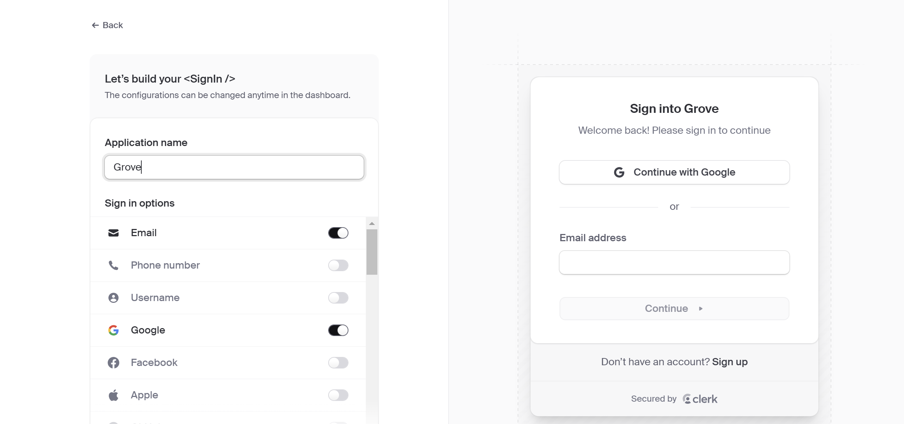

<div align="center">

[إنجليزي](./README.en.md)\|[مبسطة الصينية](./README.zh-CN.md)\|[العربية](./README.ar.md)\|[فرنسي](./README.fr.md)\|[اليابانية](./README.ja.md)

</div>
<div align="center">
  <h1>GroveChat</h1>
  <a href='#企業版'>
    
  </a>

  <p>一鍵免費部署你的私人 ChatGPT 網頁應用，支持 GPT3、GPT4 和 Gemini Pro 模型。</p>

  <p>
    <a href="https://grove-chat.vercel.app">GroveChat</a> / 
    <a href="https://grove-chat.vercel.app">企業版</a> / 
    <a href="https://grove-chat.vercel.app">演示 Demo</a> / 
    <a href="https://github.com/robbiedood/grove-chat/issues">反饋 Issues</a>
  </p>

  <a href="https://vercel.com/new/clone?repository-url=https://github.com/robbiedood/grove-chat&env=OPENAI_API_KEY&env=CLERK_SECRET_KEY&env=CLERK_WEBHOOK_SECRET&env=NEXT_PUBLIC_CLERK_PUBLISHABLE_KEY&project-name=grove-chat&repository-name=grove-chat">
    
  </a>
</div>

## جدول المحتويات

-   [Enterprise Edition](#企業版)
-   [ميزات وظيفية](#功能特點)
-   [ابدأ](#開始使用)
-   [تكوين كلمة مرور الوصول إلى الصفحة](#配置頁面訪問密碼)
-   [متغيرات البيئة](#環境變量)
-   [إعدادات نموذج المستخدم](#用戶模型設置)
-   [التنمية المحلية](#開發)
-   [لقطة شاشة](#截圖)
-   [المشاريع ذات الصلة](#相關項目)
-   [بروتوكول مفتوح المصدر](#開源協議)
-   [تغيير الوصف](./CHANGELOG.md)

## Enterprise Edition

تلبية احتياجات نشر وتخصيص خصخصة شركتك

-   **تخصيص العلامة التجارية**: مخصص VI/UI للمؤسسات ، يناسب بشكل سلس صورة العلامة التجارية للشركة
-   **تكامل الموارد**: مديري المؤسسات يقومون بتكوين وإدارة العشرات من موارد الذكاء الاصطناعى ، ويمكن لأعضاء الفريق استخدامه خارج الصندوق
-   **إدارة الإذن**: يتم تحديد أذونات الأعضاء ، وأذونات الموارد ، وأذونات قاعدة المعرفة بوضوح ، وتحكم لوحة المسؤول على مستوى المؤسسة
-   **الوصول إلى المعرفة**: يتم دمج قاعدة المعرفة الداخلية للمؤسسة مع قدرات الذكاء الاصطناع
-   **تدقيق الأمن**: اعتراض الأسئلة الحساسة تلقائيًا ، ودعم تتبع جميع سجلات الحوار التاريخية ، بحيث يمكن لـ AI أيضًا اتباع مواصفات أمان معلومات المؤسسة
-   **النشر الخاص**: النشر الخاص على مستوى المؤسسة ، ودعم العديد من عمليات النشر السحابية الخاصة السائدة ، وضمان أمان البيانات وحماية الخصوصية
-   **تحديث مستمر**: تقديم خدمات للتحديث المستمر وترقية القدرات المتطورة مثل الوسائط المتعددة والوكلاء ، وهي دائمًا جديدة ومتقدمة بشكل مستمر.

استشارة Enterprise Edition:**فارغ**


## ميزات وظيفية

-   النشر على Vercel مجانًا في أقل من دقيقة واحدة
-   عميل Lite (حوالي 5 ميجابايت) لـ Linux/Windows/MacOS ، قم بتنزيل الآن
-   متوافق تمامًا مع LLM المنحنى ذاتيًا ، يوصى باستخدامه مع RWKV-runner أو Localai
-   تفضل الخصوصية ، يتم تخزين جميع البيانات في متصفح محلي
-   تخفيض الدعم: اللاتكس ، حورية البحر ، تمييز الكود ، إلخ.
-   التصميم المستجيب ودعم الوضع المظلم و PWA
-   يتم تحميل الشاشة الأولى بسرعة (حوالي 100 كيلو بايت) ، تدعم استجابة البث
-   ميزات V2 الجديدة: قم بإنشاء وتبادل وتصحيح أدوات الدردشة الخاصة بك باستخدام قوالب موجهة (أقنعة)
-   ضغط سجل الدردشة تلقائيًا لدعم المحادثات الطويلة أثناء حفظ الرموز المميزة الخاصة بك
-   الدعم متعدد اللغات: اللغة الإنجليزية ، الصينية المبسطة ، الصينية التقليدية ، اليابانية ، الفرنسية ، الإسبانية ، الإيطالية ، التركية ، الألمانية ، الفيتنامية ، الروسية ، التشيكية ، الكورية ، الإندونيسية

## ابدأ

1.  استعد لك[مفتاح API Openai](https://platform.openai.com/account/api-keys);
2.  استخدم الموظف كإدارة إذن للمستخدم[موقع كاتب رسمي](https://clerk.com/)[ملف التكوين](#配置頁面訪問密碼)
3.  انقر فوق الزر الموجود على اليمين لبدء النشر:[](https://vercel.com/new/clone?repository-url=https://github.com/robbiedood/grove-chat&env=OPENAI_API_KEY&env=CLERK_SECRET_KEY&env=CLERK_WEBHOOK_SECRET&env=NEXT_PUBLIC_CLERK_PUBLISHABLE_KEY&project-name=grove-chat&repository-name=grove-chat)، ما عليك سوى استخدام حساب github لتسجيل الدخول ، تذكر أن تملأ مفتاح API و[إدارة إذن المستخدم](#配置訪問權限Clerk)موظف؛
4.  بعد الانتهاء من النشر ، يمكنك البدء في استخدامه ؛
5.  (خياري)[ربط اسم المجال المخصص](https://vercel.com/docs/concepts/projects/domains/add-a-domain): اسم المجال المخصّب من Vercel يتم تلوث DNS في بعض المناطق ، بحيث يمكنك الاتصال مباشرة باسم المجال المخصص عن طريق ربطه.

<div align="center">
   


</div>

## تكوين كلمة مرور الوصول إلى الصفحة

> لقد أدى هذا المشروع إلى إهمال متغيرات بيئة التعليمات البرمجية للمشروع الأصلي NextChat واستخدم صفحة إدارة الموظفين للوصول إلى كلمة المرور.
>
> ### الخطوة 1: تسجيل حساب كاتب
>
> يذهب[موقع كاتب رسمي](https://clerk.com/)، قم بتسجيل حساب وقم بتسجيل الدخول. بعد تسجيل الدخول ، انقر فوق**إنشاء التطبيق**(بناء تطبيق).


### الخطوة 2: حدد خيار تسجيل الدخول

يُمكَِن**بريد إلكتروني**(ضروري) و**جوجل**(حدد) الخيار ، كما هو موضح في الشكل أدناه.



### الخطوة 3: الحصول على مفتاح API

ابحث عن لك`NEXT_PUBLIC_CLERK_PUBLISHABLE_KEY`و`CLERK_SECRET_KEY`. إضافتها إلى`.env`في الأرشيف ، كما هو موضح أدناه:

```env
NEXT_PUBLIC_CLERK_PUBLISHABLE_KEY=你的公開金鑰
CLERK_SECRET_KEY=你的密鑰
```


### الخطوة 4: تكوين البريد الإلكتروني وكلمة المرور

يذهب**تكوين> البريد الإلكتروني ، الهاتف ، اسم المستخدم**(التكوين> البريد الإلكتروني ، الهاتف ، اسم المستخدم) ، تأكد من تمكين**بريد إلكتروني**(بريد إلكتروني)،**كلمة المرور**(كلمة المرور) و**رمز التحقق من البريد الإلكتروني**(رمز التحقق من البريد الإلكتروني).


### الخطوة 5: تكوين الأدوار والأذونات

حدد الأدوار والأذونات كما هو موضح في الشكل أدناه:


### الخطوة 6: الإعدادات العامة

يذهب**تكوين> الإعدادات**(التكوين> الإعدادات) ، وتعيين الخيارات كما هو موضح في الشكل أدناه:


### الخطوة 7: تكوين webhook

اضبط نقطة نهاية الويب على عنوان URL للاستماع. انقر**سر التوقيع**(مفتاح التوقيع) عرض الخاص بك`CLERK_WEBHOOK_SECRET`وأضفه إلى`.env`في الملف:

```env
CLERK_WEBHOOK_SECRET=你的webhook密鑰
```


### الخطوة 8: إنشاء مستخدم

إنشاء حساب مستخدم حسب الحاجة.


### الخطوة 9: بناء منظمة

قم بإنشاء مؤسسة وإضافة عنوان بريد إلكتروني للمطور. ضبط أدوارهم على**مدرس**(مدرس).

## إدارة تطبيقات Grove متعددة الإدارة

### الخطوة 1: بناء منظمة

انقر على الزاوية اليسرى العلوية**إنشاء منظمة**(بناء منظمة).

### الخطوة 2: نقل الملكية

يذهب**تكوين> الإعدادات**(التكوين> الإعدادات) ، انقر فوق**نقل الملكية**(نقل الملكية). اضبط المالك الجديد على المنظمة التي قمت بإنشائها للتو.


### الخطوة 3: إضافة مستخدمين آخرين

انقر على الزاوية اليسرى العلوية**يدير**(الإدارة) لإضافة مستخدمين آخرين ومنحهم حقوق الوصول الإدارية.


## متغيرات البيئة

> يتم تعيين معظم عناصر التكوين في هذا المشروع من خلال متغيرات البيئة.[كيفية تعديل متغيرات بيئة Vercel](./docs/vercel-cn.md)。

### `OPENAI_API_KEY`(مطلوب)

يستخدم Openai Key ، مفتاح API الذي تتقدم إليه على صفحة حساب Openai ، فاصلة باللغة الإنجليزية لفصل مفاتيح متعددة ، بحيث يمكن استطلاع هذه المفاتيح بشكل عشوائي.

### `CLERK_SECRET_KEY`(مطلوب)

إدارة المستخدم

### `CLERK_WEBHOOK_SECRET`(مطلوب)

إدارة المستخدم

### `NEXT_PUBLIC_CLERK_PUBLISHABLE_KEY`(مطلوب)

إدارة المستخدم

### `BASE_URL`(خياري)

> تقصير:`https://api.openai.com`

> مثال:`http://your-openai-proxy.com`

url Openai Interface Proxy url ، إذا قمت بتكوين وكيل Openai Interface يدويًا ، فيرجى ملء هذا الخيار.

> إذا واجهت مشاكل شهادة SSL ، فيرجى القدر`BASE_URL`تم تعيين البروتوكول على HTTP.

### `OPENAI_ORG_ID`(خياري)

يحدد معرف المنظمة في Openai.

### `AZURE_URL`(خياري)

> على سبيل المثال: https&#x3A; // {azure-resource-url}/openai

عنوان نشر Azure.

### `AZURE_API_KEY`(خياري)

مفتاح أزور.

### `AZURE_API_VERSION`(خياري)

إصدار Azure API ، يمكنك العثور عليه هنا:[وثائق Azure](https://learn.microsoft.com/en-us/azure/ai-services/openai/reference#chat-completions)。

### `GOOGLE_API_KEY`(خياري)

مفتاح Google Gemini Pro.

### `GOOGLE_URL`(خياري)

Google Gemini Pro API url。

### `ANTHROPIC_API_KEY`(خياري)

مفتاح API الأنثروبري

### `ANTHROPIC_API_VERSION`(خياري)

إصدار API Claude.

### `ANTHROPIC_URL`(خياري)

url API Claud Claud

### `BAIDU_API_KEY`(خياري)

مفتاح API Baidu。

### `BAIDU_SECRET_KEY`(خياري)

مفتاح بايدو السري。

### `BAIDU_URL`(خياري)

URL url API bedu。

### `BYTEDANCE_API_KEY`(خياري)

brenchy apolishing الجنوب.

### `BYTEDANCE_URL`(خياري)

url url edl。。。

### `ALIBABA_API_KEY`(خياري)

Alibaba Cloud (Qianwen) API مفتاح.

### `ALIBABA_URL`(خياري)

Alibaba Cloud (Qianqu) API URL.

### `IFLYTEK_URL`(خياري)

Iflytek API url.

### `IFLYTEK_API_KEY`(خياري)

مفتاح Iflytek API.

### `IFLYTEK_API_SECRET`(خياري)

Iflytek API السر.

### `CHATGLM_API_KEY`(خياري)

مفتاح chatglm API。

### `CHATGLM_URL`(خياري)

url atl atl at。。。

### `XAI_API_KEY`(خياري)

XAI API Key。

### `XAI_URL`(خياري)

و

### `PERPLEXITY_API_KEY`(خياري)

مفتاح API في الحيرة。

### `PERPLEXITY_URL`(خياري)

URL API في الحيرة。

### `MOONSHOT_API_KEY`(خياري)

مفتاح API Moonshot。

### `MOONSHOT_URL`(خياري)

Moonshot API url

### `HIDE_USER_API_KEY`(خياري)

إذا كنت لا تريد أن يملأ المستخدم مفتاح API ، فقم بتعيين متغير البيئة على 1.

### `DISABLE_GPT4`(خياري)

إذا كنت لا تريد أن يستخدم المستخدمون GPT-4 ، فما عليك سوى تعيين متغير البيئة على 1.

### `ENABLE_BALANCE_QUERY`(خياري)

إذا كنت ترغب في تمكين استعلام التوازن ، فقم بتعيين متغير البيئة إلى 1.

### `DISABLE_FAST_LINK`(خياري)

إذا كنت ترغب في تعطيل إعدادات التحليل المسبق من الروابط ، فقم بتعيين متغير البيئة إلى 1.

### `WHITE_WEBDAV_ENDPOINTS`(خياري)

إذا كنت ترغب في إضافة عنوان خدمة WebDAV المسموح للوصول إليه ، فيمكنك استخدام هذا الخيار ، متطلبات التنسيق:

-   يجب أن يكون كل عنوان نقطة نهاية كاملة
    > `https://xxxx/xxx`
-   عناوين متعددة ل`,`متصل

### `CUSTOM_MODELS`(خياري)

> مثال:`+qwen-7b-chat,+glm-6b,-gpt-3.5-turbo,gpt-4-1106-preview=gpt-4-turbo`يشير إلى زيادة`qwen-7b-chat`و`glm-6b`إلى قائمة النماذج وحذفها من القائمة`gpt-3.5-turbo`ويل`gpt-4-1106-preview`يتم عرض اسم الطراز على أنه`gpt-4-turbo`。  
> إذا كنت ترغب في تعطيل جميع النماذج أولاً ثم تمكين النموذج المحدد ، فيمكنك الاستخدام`-all,+gpt-3.5-turbo`، يعني التمكين فقط`gpt-3.5-turbo`。

تستخدم للتحكم في قائمة النماذج ، والاستخدام`+`أضف نموذجًا للاستخدام`-`لإخفاء نموذج ، استخدم`模型名=展示名`تخصيص اسم العرض التقديمي للنموذج ، مفصولة بفواصل اللغة الإنجليزية.

في وضع Azure ، يتم دعمه`modelName@Azure=deploymentName`اسم النموذج القابل للتكوين واسم النشر (اسم النشر) في الطريق.

> مثال:`+gpt-3.5-turbo@Azure=gpt35`سيعرض هذا التكوين ملف`gpt35(Azure)`خيار.  
> إذا كان يمكنك استخدام وضع Azure فقط ، فقم بتعيينه`-all,+gpt-3.5-turbo@Azure=gpt35`هذا يسمح للاستخدام الافتراضي للمحادثة`gpt35(Azure)`。

في وضع bytedance ، يتم دعمه لاستخدامه`modelName@bytedance=deploymentName`اسم النموذج القابل للتكوين واسم النشر (اسم النشر) في الطريق.

> مثال:`+Doubao-lite-4k@bytedance=ep-xxxxx-xxx`سيعرض هذا التكوين ملف`Doubao-lite-4k(ByteDance)`خيار.

### `DEFAULT_MODEL`(خياري)

تغيير النموذج الافتراضي.

### `DEFAULT_INPUT_TEMPLATE`(خياري)

تخصيص القالب الافتراضي لتهيئة عنصر تكوين "إدخال المستخدم قبل المعالجة" في "الإعدادات".

### `STABILITY_API_KEY`(خياري)

مفتاح الاستقرار API.

### `STABILITY_URL`(خياري)

عنوان طلب API الاستقرار المخصص.

## إعدادات نموذج المستخدم

تسجيل الدخول

> يمكن استخدام مفتاح API الذي تم تعيينه بواسطة النظام وفقًا لأعلى أذونات المستخدم.

لم يتم تسجيل الدخول

> إذا لم يتم تسجيل الدخول ، فيمكنك ملء مفتاح API الخاص بك في إعدادات الوكيل واستخدام نموذج الضيف.

دور المستخدم بعد تسجيل الدخول

> ضيف

يمكن تغيير أذونات الأدوار في لوحة معلومات الموظفين

> [تدريس التكوين الكاتب](#配置頁面訪問密碼)

بعد تكوين كاتب ، يمكن لأذونات المعلم إدارة المؤسسة مباشرة ودعوة الأعضاء إلى مزيد من التحكم في النماذج التي يمكن الوصول إليها في صفحة إعدادات دردشة Grove.

### نموذج إضافي

[ملف رمز البرنامج](./app/constant.ts)

ابحث عن بائع النموذج لإضافة نموذج جديد

    const openaiModels = [
      "gpt-3.5-turbo",
      "gpt-3.5-turbo-1106",
      "gpt-3.5-turbo-0125",
      "gpt-4",
      "gpt-4-0613",
      "gpt-4-32k",
      "gpt-4-32k-0613",
      "gpt-4-turbo",
      "gpt-4-turbo-preview",
      "gpt-4o",
      "gpt-4o-2024-05-13",
      "gpt-4o-2024-08-06",
      "gpt-4o-2024-11-20",
      "chatgpt-4o-latest",
      "gpt-4o-mini",
      "gpt-4o-mini-2024-07-18",
      "gpt-4-vision-preview",
      "gpt-4-turbo-2024-04-09",
      "gpt-4-1106-preview",
      "dall-e-3",
      "o1-mini",
      "o1-preview",
    ];

إدارة أذونات الوصول (يجب أن تكون في قائمة النماذج لموردي النماذج)

      teacher: [
        "o1-mini",
        "o1-preview",
        "gpt-4o-2024-08-06",
        "gpt-4o-mini",
        "claude-3-sonnet-20240229",
        "claude-3-5-sonnet-20240620",
        "llama-3.1-sonar-small-128k-online",
        "llama-3.1-sonar-large-128k-online",
        "llama-3.1-sonar-huge-128k-online",
        "gemini-1.5-pro-latest",
        "gemini-1.5-flash-latest",
        "moonshot-v1-128k",
        "moonshot-v1-32k",
        "grok-2-1212",
        "grok-2-vision-1212",
      ],

## تطوير

يمكن للمستخدمين الصينيين في البر الرئيسي استخدام الوكلاء الذين يأتي مع هذا المشروع للتطوير ، ويمكنك أيضًا اختيار عناوين الوكيل الأخرى بحرية.
BASE_URL =<https://b.nextweb.fun/api/proxy>

### التنمية المحلية

1.  إنشاء واحدة جديدة في دليل جذر المشروع`.env.local`ملف ، املأ متغيرات البيئة:


    OPENAI_API_KEY=<your key here>
    CLERK_SECRET_KEY=<your key here>
    CLERK_WEBHOOK_SECRET=<your key here>
    NEXT_PUBLIC_CLERK_PUBLISHABLE_KEY=<your key here>

2.  تثبيت Node.js 18 والغزل.
3.  ينفذ`yarn install && yarn dev`افعل ذلك. ⚠ ملاحظة: يستخدم هذا الأمر فقط للتطوير المحلي وليس للنشر!
4.  إذا كنت ترغب في النشر محليًا ، يرجى الاستخدام`yarn install && yarn build && yarn start`الأمر ، يمكنك التعاون مع PM2 إلى Daemon لمنع قتل ، اطلب ChatGPT للحصول على التفاصيل.

### نشر الحاوية

> يجب أن يكون إصدار Docker 20 أو أعلى ، وإلا فلن يتم العثور على الصورة.

> ⚠ ملاحظة: سوف يتخلف إصدار Docker عن أحدث إصدار من 1 إلى يومين معظم الوقت ، لذلك سيستمر "تحديث الوجود" الموجه بعد النشر ، وهو أمر طبيعي.

```shell
docker pull robbiedood/grove-chat

docker run -d -p 3000:3000 \
   -e OPENAI_API_KEY=sk-xxxx \
   -e CLERK_SECRET_KEY=<your key here> \
   -e CLERK_WEBHOOK_SECRET=<your key here> \
   -e NEXT_PUBLIC_CLERK_PUBLISHABLE_KEY=<your key here> \
   robbiedood/grove-chat
```

يمكنك أيضًا تحديد الوكيل:

```shell
docker run -d -p 3000:3000 \
   -e OPENAI_API_KEY=sk-xxxx \
   -e CLERK_SECRET_KEY=<your key here> \
   -e CLERK_WEBHOOK_SECRET=<your key here> \
   -e NEXT_PUBLIC_CLERK_PUBLISHABLE_KEY=<your key here> \
   --net=host \
   -e PROXY_URL=http://127.0.0.1:7890 \
   robbiedood/grove-chat
```

إذا كان وكيلك المحلي يحتاج إلى كلمة مرور حساب ، فيمكنك استخدام:

```shell
-e PROXY_URL="http://127.0.0.1:7890 user password"
```

إذا كنت بحاجة إلى تحديد متغيرات البيئة الأخرى ، فيرجى إضافتها إلى الأمر أعلاه`-e 環境變量=環境變量值`لتحديد.

### النشر المحلي

قم بتشغيل الأمر التالي في وحدة التحكم:

```shell
bash <(curl -s https://raw.githubusercontent.com/robbiedood/grove-chat/main/scripts/setup.sh)
```

⚠ ملاحظة: إذا واجهت مشاكل أثناء عملية التثبيت ، فيرجى استخدام Docker للنشر.

## لقطة شاشة

<div style="display: flex; gap: 20px;">
  
</div>

### المشاريع ذات الصلة

-   [chatgpt-next-web](https://github.com/ChatGPTNextWeb/ChatGPT-Next-Web):
    منصة نموذجية واحدة واحدة ، تدعم جميع نماذج اللغة الكبيرة السائدة في السوق.

-   [واحد api](https://github.com/songquanpeng/one-api): منصة إدارة حصة الحصص الكبيرة ذات الطراز الكبير ، ودعم جميع الطرز الكبيرة في السوق.

-   [السيد رايدري لديك مدرس](https://github.com/JushBJJ/Mr.-Ranedeer-AI-Tutor): AI-TUTOR

## بروتوكول مفتوح المصدر

[مع](https://opensource.org/license/mit/)
