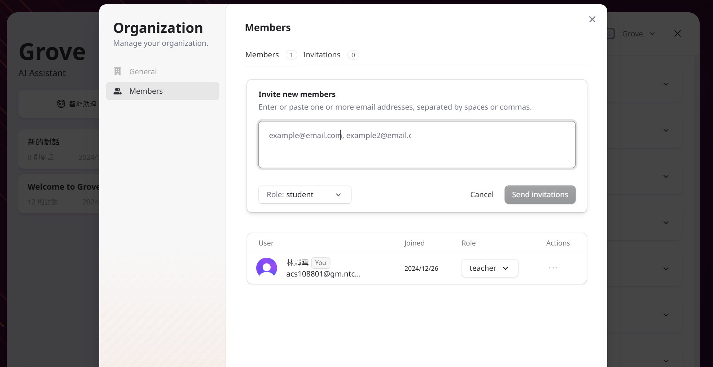

<div align="center">

[English](./README.en.md)\|[Simplified Chinese](./README.zh-CN.md)\|[Arabic](./README.ar.md)\|[French](./README.fr.md)\|[Japanese](./README.ja.md)

</div>
<div align="center">
  <h1>GroveChat</h1>
  <a href='#企業版'>
    
  </a>

  <p>一鍵免費部署你的私人 ChatGPT 網頁應用，支持 GPT3、GPT4 和 Gemini Pro 模型。</p>

  <p>
    <a href="https://grove-chat.vercel.app">GroveChat</a> / 
    <a href="https://grove-chat.vercel.app">企業版</a> / 
    <a href="https://grove-chat.vercel.app">演示 Demo</a> / 
    <a href="https://github.com/robbiedood/grove-chat/issues">反饋 Issues</a>
  </p>

  <a href="https://vercel.com/new/clone?repository-url=https://github.com/robbiedood/grove-chat&env=OPENAI_API_KEY&env=CLERK_SECRET_KEY&env=CLERK_WEBHOOK_SECRET&env=NEXT_PUBLIC_CLERK_PUBLISHABLE_KEY&project-name=grove-chat&repository-name=grove-chat">
    
  </a>
</div>

## Table of contents

-   [Enterprise Edition](#企業版)
-   [Features](#功能特點)
-   [Get started](#開始使用)
-   [Configure page access password](#配置頁面訪問密碼)
-   [environment variables](#環境變量)
-   [User model settings](#用戶模型設置)
-   [local development](#開發)
-   [screenshot](#截圖)
-   [Related projects](#相關項目)
-   [Open source agreement](#開源協議)

## Enterprise Edition

Meet your company’s private deployment and customization needs

-   **Brand customization**: Enterprise-tailored VI/UI, seamlessly matching the corporate brand image
-   **Resource integration**: Dozens of AI resources are configured and managed uniformly by enterprise managers, and team members can use them out of the box
-   **Permission management**: Member permissions, resource permissions, and knowledge base permissions are clearly hierarchical and unified controlled by the enterprise-level Admin Panel
-   **knowledge access**: The combination of an enterprise's internal knowledge base and AI capabilities is closer to the enterprise's own business needs than general AI.
-   **security audit**: Automatically intercept sensitive questions and support tracing all historical conversation records, allowing AI to also comply with corporate information security regulations.
-   **private deployment**: Enterprise-level private deployment, supporting various mainstream private cloud deployments to ensure data security and privacy protection
-   **Continuous updates**: Provide continuous updating and upgrading services for cutting-edge capabilities such as multi-modality and intelligence, which are frequently used and constantly advanced.

Enterprise version consultation:**empty**


## Features

-   Deploy on Vercel for free with one click and takes less than 1 minute
-   Streamlined client (~5MB) for Linux/Windows/MacOS, download now
-   Fully compatible with self-deployed LLM, recommended for use with RWKV-Runner or LocalAI
-   Privacy first, all data is stored locally in the browser
-   Support Markdown: LaTex, mermaid, code highlighting, etc.
-   Responsive design, supports dark mode and PWA
-   The first screen loads quickly (about 100kb) and supports streaming response
-   New in v2: Use prompt templates (mask) to create, share and debug your chat tools
-   Automatically compress chat history to support long conversations while saving your tokens
-   Multi-language support: English, Simplified Chinese, Traditional Chinese, Japanese, French, Spanish, Italian, Turkish, German, Vietnamese, Russian, Czech, Korean, Indonesian

## Get started

1.  get yours ready[OpenAI API Key](https://platform.openai.com/account/api-keys);
2.  Using Clerk as User Permission Management[Clerk official website](https://clerk.com/)[Configuration file](https://github.com/robbiedood/grove-chat/tree/main/docs)
3.  Click the button on the right to start deployment:[](https://vercel.com/new/clone?repository-url=https://github.com/robbiedood/grove-chat&env=OPENAI_API_KEY&env=CLERK_SECRET_KEY&env=CLERK_WEBHOOK_SECRET&env=NEXT_PUBLIC_CLERK_PUBLISHABLE_KEY&project-name=grove-chat&repository-name=grove-chat), just log in directly with your GitHub account. Remember to fill in the API Key and[User rights management](#配置訪問權限Clerk)Clerk；
4.  After deployment is completed, you can start using it;
5.  (optional)[Bind a custom domain name](https://vercel.com/docs/concepts/projects/domains/add-a-domain): The domain name DNS assigned by Vercel is contaminated in some areas. Bind a custom domain name to connect directly.

<div align="center">
   


</div>

## Configure page access password

> This project has abandoned the CODE environment variable of the original project NextChat and uses the Clerk management page access password.
>
> ### Step 1: Sign up for a Clerk account
>
> Go to[Clerk official website](https://clerk.com/), register an account and log in. After logging in, click**Create Application**(Build Application).


### Step 2: Select a login option

enable**Email**(required) and**Google**(optional) option, as shown below.


### Step 3: Obtain API key

find your`NEXT_PUBLIC_CLERK_PUBLISHABLE_KEY`and`CLERK_SECRET_KEY`. add them to`.env`file, as shown below:

```env
NEXT_PUBLIC_CLERK_PUBLISHABLE_KEY=你的公開金鑰
CLERK_SECRET_KEY=你的密鑰
```


### Step 4: Configure email and password

Go to**Configure > Email, phone, username**(Configuration > Email, Phone, Username), make sure it is enabled**Email**(e-mail),**Password**(password) and**Email verification code**(email verification code).


### Step 5: Configure roles and permissions

Set roles and permissions as shown in the figure below:


### Step 6: General settings

Go to**Configure > Settings**(Configuration > Settings) and set the options as shown below:


### Step 7: Configure Webhooks

Set the webhook endpoint to your listening URL. Click**Signing Secret**(signing key) View your`CLERK_WEBHOOK_SECRET`, and add it to`.env`In the archives:

```env
CLERK_WEBHOOK_SECRET=你的webhook密鑰
```


### Step 8: Create users

Create user accounts as needed.


### Step 9: Build an organization

Set up an organization and add the developer's email address. Set their role to**Teacher**(teacher).

## Manage multi-administrator Grove applications

### Step 1: Build an organization

Click on the upper left corner**Create Organization**(Build an organization).

### Step 2: Transfer ownership

Go to**Configure > Settings**(Configuration > Settings), click**Transfer Ownership**(Transfer of ownership). Set the new owner to the organization you just created.


### Step 3: Add additional users

Click on the upper left corner**Manage**(Admin) to add additional users and grant them administrative access.




## environment variables

> Most of the configuration items in this project are set through environment variables. Tutorial:[How to modify Vercel environment variables](./docs/vercel-cn.md)。

### `OPENAI_API_KEY`(required)

OpenAI key, the api key you applied for on the openai account page, use English commas to separate multiple keys, so that these keys can be randomly polled.

### `CLERK_SECRET_KEY`(required)

Clerk user management

### `CLERK_WEBHOOK_SECRET`(required)

Clerk user management

### `NEXT_PUBLIC_CLERK_PUBLISHABLE_KEY`(required)

Clerk user management

### `BASE_URL`(optional)

> default:`https://api.openai.com`

> Example:`http://your-openai-proxy.com`

OpenAI interface proxy URL, if you manually configured the openai interface proxy, please fill in this option.

> If you have issues with ssl certificate, please replace`BASE_URL`The protocol is set to http.

### `OPENAI_ORG_ID`(optional)

Specify the organization ID in OpenAI.

### `AZURE_URL`(optional)

> Shape like: https&#x3A;//{azure-resource-url}/openai

Azure deployment address.

### `AZURE_API_KEY`(optional)

Azure key.

### `AZURE_API_VERSION`(optional)

Azure API version you can find here:[Azure documentation](https://learn.microsoft.com/en-us/azure/ai-services/openai/reference#chat-completions)。

### `GOOGLE_API_KEY`(optional)

Google Gemini Pro Key.

### `GOOGLE_URL`(optional)

Google Gemini Pro Api Url。

### `ANTHROPIC_API_KEY`(optional)

Anthropic Claude Api Key。

### `ANTHROPIC_API_VERSION`(optional)

Anthropic Claude API version.

### `ANTHROPIC_URL`(optional)

Anthropic Claude Api Url。

### `BAIDU_API_KEY`(optional)

Baidu Fire Key。

### `BAIDU_SECRET_KEY`(optional)

Baidu Secret Key。

### `BAIDU_URL`(optional)

Baidu Fire Url。

### `BYTEDANCE_API_KEY`(optional)

ByteDance Api Key。

### `BYTEDANCE_URL`(optional)

ByteDance Api Url。

### `ALIBABA_API_KEY`(optional)

Alibaba Cloud (Qianwen) API Key.

### `ALIBABA_URL`(optional)

Alibaba Cloud (Qianwen) API Url.

### `IFLYTEK_URL`(optional)

iFlytek Spark Api Url.

### `IFLYTEK_API_KEY`(optional)

iFlytek Spark API Key.

### `IFLYTEK_API_SECRET`(optional)

iFlytek Spark Api Secret.

### `CHATGLM_API_KEY`(optional)

ChatGLM Api Key。

### `CHATGLM_URL`(optional)

ChatGLM Api Url。

### `XAI_API_KEY`(optional)

XAI Api Key。

### `XAI_URL`(optional)

XAI Api Url。

### `PERPLEXITY_API_KEY`(optional)

PERPLEXITY Api Key。

### `PERPLEXITY_URL`(optional)

PERPLEXITY Api Url。

### `MOONSHOT_API_KEY`(optional)

MOONSHOT Api Key。

### `MOONSHOT_URL`(optional)

MOONSHOT Api Url

### `HIDE_USER_API_KEY`(optional)

If you don't want users to fill in the API Key by themselves, just set this environment variable to 1.

### `DISABLE_GPT4`(optional)

If you don't want your users to use GPT-4, just set this environment variable to 1.

### `ENABLE_BALANCE_QUERY`(optional)

If you want to enable the balance query function, just set this environment variable to 1.

### `DISABLE_FAST_LINK`(optional)

If you want to disable parsing prefab settings from links, set this environment variable to 1.

### `WHITE_WEBDAV_ENDPOINTS`(optional)

If you want to add the WebDAV service addresses that are allowed to be accessed, you can use this option. The format requirements are:

-   Each address must be a complete endpoint
    > `https://xxxx/xxx`
-   multiple addresses to`,`connected

### `CUSTOM_MODELS`(optional)

> Example:`+qwen-7b-chat,+glm-6b,-gpt-3.5-turbo,gpt-4-1106-preview=gpt-4-turbo`means increase`qwen-7b-chat`and`glm-6b`to the model list and remove from the list`gpt-3.5-turbo`, and will`gpt-4-1106-preview`The model name is displayed as`gpt-4-turbo`。  
> If you want to disable all models first and then enable specific models, you can use`-all,+gpt-3.5-turbo`, which means only enabling`gpt-3.5-turbo`。

To control the model list, use`+`To add a model, use`-`To hide a model, use`模型名=展示名`Display names to customize the model, separated by commas.

In Azure mode, it is supported to use`modelName@Azure=deploymentName`Configure the model name and deployment name (deploy-name).

> Example:`+gpt-3.5-turbo@Azure=gpt35`This configuration will display a`gpt35(Azure)`options.  
> If you can only use Azure mode, then set`-all,+gpt-3.5-turbo@Azure=gpt35`You can make the conversation's default use`gpt35(Azure)`。

In ByteDance mode, support the use of`modelName@bytedance=deploymentName`Configure the model name and deployment name (deploy-name).

> Example:`+Doubao-lite-4k@bytedance=ep-xxxxx-xxx`This configuration will display a`Doubao-lite-4k(ByteDance)`options.

### `DEFAULT_MODEL`(optional)

Change the default model.

### `DEFAULT_INPUT_TEMPLATE`(optional)

Customize the default template, which is used to initialize the "User Input Preprocessing" configuration item in "Settings".

### `STABILITY_API_KEY`(optional)

Stability API key.

### `STABILITY_URL`(optional)

Customized Stability API request address.

## User model settings

login

> The API Key set by the system can be used according to the user's highest authority.

Not logged in

> If you are not logged in, you can fill in your own API Key in the proxy settings to use the guest model.

User role after login

> guest

Role permissions can be changed in the Clerk dashboard

> [Clerk configuration tutorial](https://github.com/robbiedood/grove-chat/tree/main/docs)

### Add new model

[code file](./app/constant.ts)

Find model supplier to add new model

    const openaiModels = [
      "gpt-3.5-turbo",
      "gpt-3.5-turbo-1106",
      "gpt-3.5-turbo-0125",
      "gpt-4",
      "gpt-4-0613",
      "gpt-4-32k",
      "gpt-4-32k-0613",
      "gpt-4-turbo",
      "gpt-4-turbo-preview",
      "gpt-4o",
      "gpt-4o-2024-05-13",
      "gpt-4o-2024-08-06",
      "gpt-4o-2024-11-20",
      "chatgpt-4o-latest",
      "gpt-4o-mini",
      "gpt-4o-mini-2024-07-18",
      "gpt-4-vision-preview",
      "gpt-4-turbo-2024-04-09",
      "gpt-4-1106-preview",
      "dall-e-3",
      "o1-mini",
      "o1-preview",
    ];

Manage access rights (must be in the model supplier's model list)

      teacher: [
        "o1-mini",
        "o1-preview",
        "gpt-4o-2024-08-06",
        "gpt-4o-mini",
        "claude-3-sonnet-20240229",
        "claude-3-5-sonnet-20240620",
        "llama-3.1-sonar-small-128k-online",
        "llama-3.1-sonar-large-128k-online",
        "llama-3.1-sonar-huge-128k-online",
        "gemini-1.5-pro-latest",
        "gemini-1.5-flash-latest",
        "moonshot-v1-128k",
        "moonshot-v1-32k",
        "grok-2-1212",
        "grok-2-vision-1212",
      ],

## develop

Users in mainland China can use the agent that comes with this project for development. You can also freely choose other agent addresses.
BASE_URL=<https://b.nextweb.fun/api/proxy>

### local development

1.  Create a new one in the project root directory`.env.local`file, fill in the environment variables:


    OPENAI_API_KEY=<your key here>
    CLERK_SECRET_KEY=<your key here>
    CLERK_WEBHOOK_SECRET=<your key here>
    NEXT_PUBLIC_CLERK_PUBLISHABLE_KEY=<your key here>

2.  Install Node.js 18 and Yarn, please ask ChatGPT for details;
3.  implement`yarn install && yarn dev`That’s it. ⚠️ Note: This command is only for local development, do not use it for deployment!
4.  If you want to deploy locally, use`yarn install && yarn build && yarn start`command, you can use pm2 to daemonize the process to prevent it from being killed. Ask ChatGPT for details.

### Container deployment

> The Docker version needs to be 20 or above, otherwise it will prompt that the image cannot be found.

> ⚠️ Note: Most of the time, the Docker version will lag behind the latest version by 1 to 2 days, so the "update exists" prompt will continue to appear after deployment, which is normal.

```shell
docker pull robbiedood/grove-chat

docker run -d -p 3000:3000 \
   -e OPENAI_API_KEY=sk-xxxx \
   -e CLERK_SECRET_KEY=<your key here> \
   -e CLERK_WEBHOOK_SECRET=<your key here> \
   -e NEXT_PUBLIC_CLERK_PUBLISHABLE_KEY=<your key here> \
   robbiedood/grove-chat
```

You can also specify a proxy:

```shell
docker run -d -p 3000:3000 \
   -e OPENAI_API_KEY=sk-xxxx \
   -e CLERK_SECRET_KEY=<your key here> \
   -e CLERK_WEBHOOK_SECRET=<your key here> \
   -e NEXT_PUBLIC_CLERK_PUBLISHABLE_KEY=<your key here> \
   --net=host \
   -e PROXY_URL=http://127.0.0.1:7890 \
   robbiedood/grove-chat
```

If your local agent requires an account and password, you can use:

```shell
-e PROXY_URL="http://127.0.0.1:7890 user password"
```

If you need to specify other environment variables, please add them to the above command yourself.`-e 環境變量=環境變量值`to specify.

### local deployment

Run the following command on the console:

```shell
bash <(curl -s https://raw.githubusercontent.com/robbiedood/grove-chat/main/scripts/setup.sh)
```

⚠️ Note: If you encounter problems during installation, please use Docker deployment.

## screenshot

<div style="display: flex; gap: 20px;">
  
</div>

### Related projects

-   [ChatGPT-Next-Web](https://github.com/ChatGPTNextWeb/ChatGPT-Next-Web):
    A one-stop large model platform that supports all major large language models on the market.

-   [one-api](https://github.com/songquanpeng/one-api): A one-stop large model quota management platform that supports all mainstream large language models on the market.

-   [Mr.-Ranedeer-AI-Tutor](https://github.com/JushBJJ/Mr.-Ranedeer-AI-Tutor):AI-Tutor

## Open source agreement

[WITH](https://opensource.org/license/mit/)
