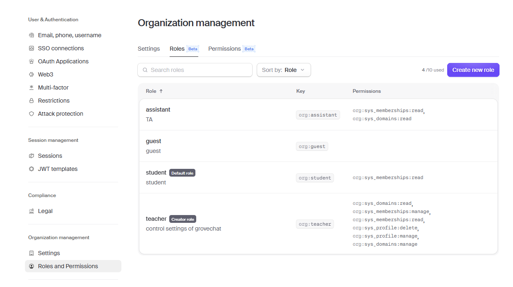
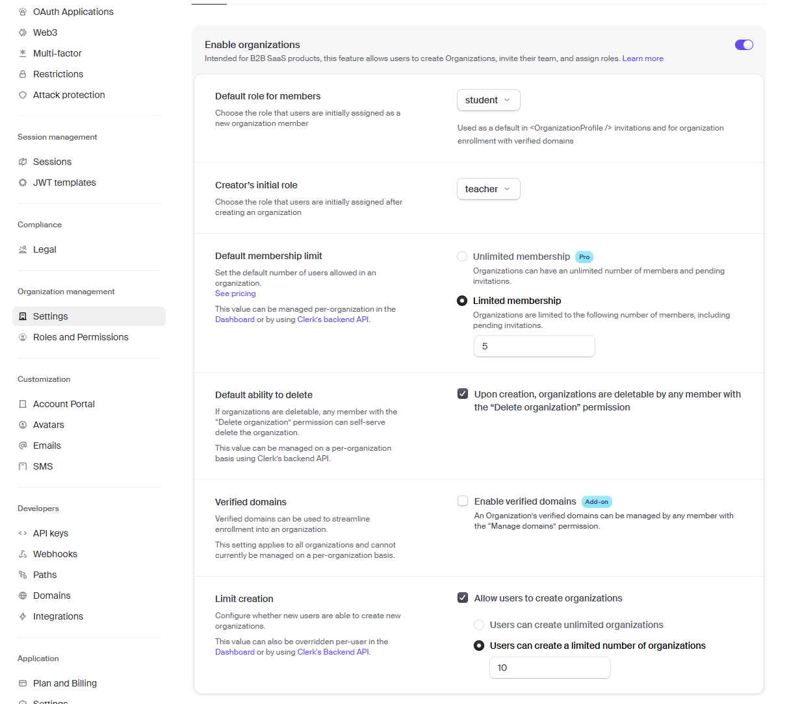
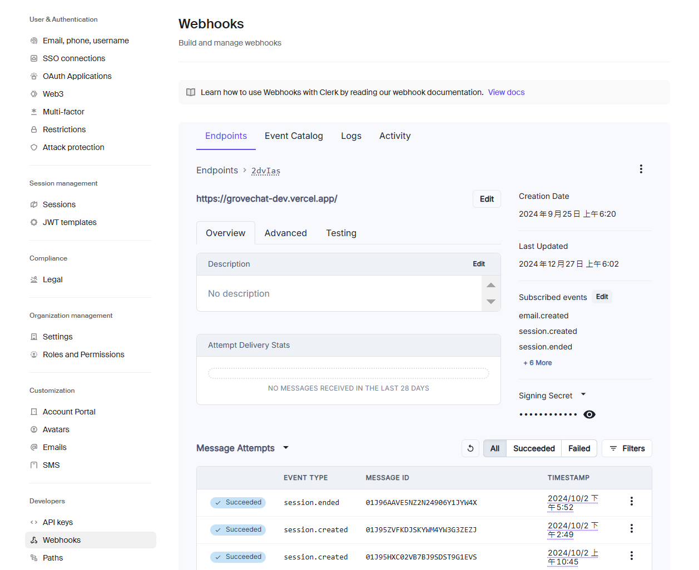
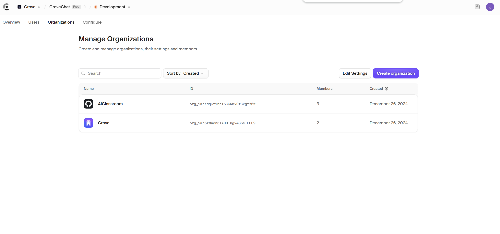
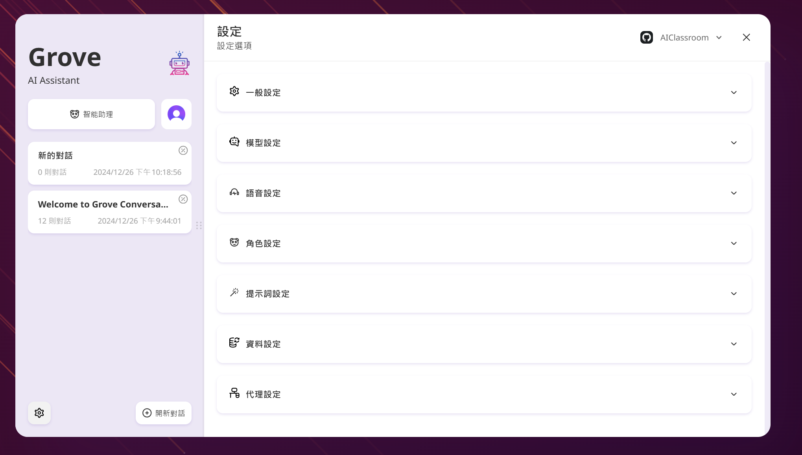

<div align="center">

[Anglais](./README.en.md)\|[Chinois simplifié](./README.zh-CN.md)\|[arabe](./README.ar.md)\|[Français](./README.fr.md)\|[japonais](./README.ja.md)

</div>
<div align="center">
  <h1>GroveChat</h1>
  <a href='#企業版'>
    
  </a>

  <p>一鍵免費部署你的私人 ChatGPT 網頁應用，支持 GPT3、GPT4 和 Gemini Pro 模型。</p>

  <p>
    <a href="https://grove-chat.vercel.app">GroveChat</a> / 
    <a href="https://grove-chat.vercel.app">企業版</a> / 
    <a href="https://grove-chat.vercel.app">演示 Demo</a> / 
    <a href="https://github.com/robbiedood/grove-chat/issues">反饋 Issues</a>
  </p>

  <a href="https://vercel.com/new/clone?repository-url=https://github.com/robbiedood/grove-chat&env=OPENAI_API_KEY&env=CLERK_SECRET_KEY&env=CLERK_WEBHOOK_SECRET&env=NEXT_PUBLIC_CLERK_PUBLISHABLE_KEY&project-name=grove-chat&repository-name=grove-chat">
    
  </a>
</div>

## Table des matières

-   [Edition d'entreprise](#企業版)
-   [Caractéristiques fonctionnelles](#功能特點)
-   [Commencer](#開始使用)
-   [Configurer le mot de passe d'accès à la page](#配置頁面訪問密碼)
-   [Variables d'environnement](#環境變量)
-   [Paramètres du modèle utilisateur](#用戶模型設置)
-   [Développement local](#開發)
-   [capture d'écran](#截圖)
-   [Projets connexes](#相關項目)
-   [Protocole open source](#開源協議)
-   [Modification description](./CHANGELOG.md)

## Edition d'entreprise

Répondez aux besoins de déploiement et de personnalisation de votre entreprise de votre entreprise

-   **Personnalisation de la marque**: VI / UI personnalisé pour les entreprises, correspond parfaitement à l'image de marque d'entreprise
-   **Intégration des ressources**: Les gestionnaires d'entreprise configurent et gèrent uniformément des dizaines de ressources d'IA, et les membres de l'équipe peuvent l'utiliser hors de la boîte
-   **Gestion de l'autorisation**: Les autorisations des membres, les autorisations de ressources et les autorisations de base de connaissances sont clairement définies et le panneau d'administration au niveau de l'entreprise Contrôle unifié
-   **Accès aux connaissances**: La base de connaissances interne de l'entreprise est combinée avec des capacités d'IA, qui est plus proche des besoins commerciaux de l'entreprise que l'IA générale
-   **Audit de sécurité**: Intercepter automatiquement les questions sensibles, supporter le traçage de tous les enregistrements de dialogue historiques, afin que l'IA puisse également suivre les spécifications de sécurité de l'information d'entreprise
-   **Déploiement privé**: Déploiement privé au niveau de l'entreprise, soutenant divers déploiements de cloud privés traditionnels, assurant la sécurité des données et la protection de la confidentialité
-   **Mise à jour continue**: Fournir des services pour la mise à jour continue et la mise à niveau des capacités de pointe telles que le multimodal et les agents, et sont toujours nouveaux et continuellement avancés.

Consultation en édition d'entreprise:**vide**


## Caractéristiques fonctionnelles

-   Déploiement sur Vercel gratuitement en moins de 1 minute
-   Client lite (environ 5 Mo) pour Linux / Windows / MacOS, téléchargez maintenant
-   Entièrement compatible avec LLM auto-déploié, il est recommandé de l'utiliser avec RWKV-Runner ou Localai
-   La confidentialité est préférée, toutes les données sont stockées dans un navigateur local
-   Support Markdown: latex, sirène, mise en évidence du code, etc.
-   Conception réactive, support pour le mode sombre et PWA
-   Le premier écran se charge rapidement (environ 100 kb), prend en charge la réponse en streaming
-   V2 Nouvelles fonctionnalités: créez, partagez et déboguez vos outils de chat à l'aide de modèles d'invite (masques)
-   Compressez automatiquement l'historique de chat pour prendre en charge de longues conversations tout en enregistrant vos jetons
-   Support multilingue: anglais, chinois simplifié, chinois traditionnel, japonais, français, espagnol, italien, turc, allemand, vietnamien, russe, tchèque, coréen, indonésien

## Commencer

1.  Préparez le vôtre[Clé API Openai](https://platform.openai.com/account/api-keys);
2.  Utilisez le greffier comme gestion de la permission des utilisateurs[Site officiel du greffier](https://clerk.com/)[Fichier de configuration](#配置頁面訪問密碼)
3.  Cliquez sur le bouton à droite pour démarrer le déploiement:[](https://vercel.com/new/clone?repository-url=https://github.com/robbiedood/grove-chat&env=OPENAI_API_KEY&env=CLERK_SECRET_KEY&env=CLERK_WEBHOOK_SECRET&env=NEXT_PUBLIC_CLERK_PUBLISHABLE_KEY&project-name=grove-chat&repository-name=grove-chat), utilisez simplement le compte GitHub pour vous connecter, n'oubliez pas de remplir la clé API et[Gestion de l'autorisation des utilisateurs](#配置訪問權限Clerk)Greffier;
4.  Une fois le déploiement terminé, vous pouvez commencer à l'utiliser;
5.  (Facultatif)[Lier le nom de domaine personnalisé](https://vercel.com/docs/concepts/projects/domains/add-a-domain): Le nom de domaine attribué par Vercel DNS est pollué dans certains domaines, vous pouvez donc vous connecter directement au nom de domaine personnalisé en le liant.

<div align="center">
   


</div>

## Configurer le mot de passe d'accès à la page

> Ce projet a obsolète les variables d'environnement de code du projet d'origine NextChat et utilisé la page de gestion du commis pour accéder au mot de passe.
>
> ### Étape 1: enregistrez un compte de commis
>
> Aller[Site officiel du greffier](https://clerk.com/), enregistrez un compte et connectez-vous. Après vous être connecté, cliquez**Créer une application**(Construire une application).


### Étape 2: Sélectionnez l'option de connexion

Activer**E-mail**(nécessaire) et**Google**(Sélectionnez) Option, comme indiqué dans la figure ci-dessous.


### Étape 3: Obtenez la clé API

Trouvez le vôtre`NEXT_PUBLIC_CLERK_PUBLISHABLE_KEY`et`CLERK_SECRET_KEY`. Les ajouter à`.env`Dans les archives, comme indiqué ci-dessous:

```env
NEXT_PUBLIC_CLERK_PUBLISHABLE_KEY=你的公開金鑰
CLERK_SECRET_KEY=你的密鑰
```


### Étape 4: Configurer les e-mails et le mot de passe

Aller**Configurer> e-mail, téléphone, nom d'utilisateur**(Configuration> e-mail, téléphone, nom d'utilisateur), assurez-vous d'activer**E-mail**(e-mail),**Mot de passe**(Mot de passe) et**Code de vérification par e-mail**(Code de vérification par e-mail).


### Étape 5: Configurer les rôles et les autorisations

Définissez les rôles et les autorisations comme indiqué dans la figure ci-dessous:



### Étape 6: Paramètres généraux

Aller**Configurer> Paramètres**(Configuration> Paramètres) et définissez les options comme indiqué dans la figure ci-dessous:



### Étape 7: Configurer WebHook

Définissez le point de terminaison WebHook sur votre URL d'écoute. Faire un clic**Secret de signature**(Clé de signature) Affichez votre`CLERK_WEBHOOK_SECRET`et l'ajouter à`.env`Dans le fichier:

```env
CLERK_WEBHOOK_SECRET=你的webhook密鑰
```



### Étape 8: Créez un utilisateur

Créez un compte d'utilisateur au besoin.


### Étape 9: construire une organisation

Créez une organisation et ajoutez l'adresse e-mail d'un développeur. Définir leurs rôles à**Professeur**(professeur).

## Gérer les applications multi-administrateurs Grove

### Étape 1: construire une organisation

Cliquez sur le coin supérieur gauche**Créer une organisation**(Construire une organisation).

### Étape 2: Transférer la propriété

Aller**Configurer> Paramètres**(Configuration> Paramètres), cliquez**Transférer la propriété**(Transfert de propriété). Réglez le nouveau propriétaire sur l'organisation que vous venez de construire.


### Étape 3: Ajouter d'autres utilisateurs

Cliquez sur le coin supérieur gauche**Gérer**(Gestion) Pour ajouter d'autres utilisateurs et leur accorder des droits d'accès administratifs.


## Variables d'environnement

> La plupart des éléments de configuration de ce projet sont définis via des variables d'environnement.[Comment modifier les variables d'environnement Vercel](./docs/vercel-cn.md)。

### `OPENAI_API_KEY`(Requis)

Key Openai, la clé API que vous postulez sur la page du compte OpenAI, utilise une virgule anglaise pour séparer plusieurs clés, afin que ces clés puissent être interrogées au hasard.

### `CLERK_SECRET_KEY`(Requis)

Gestion des utilisateurs du greffier

### `CLERK_WEBHOOK_SECRET`(Requis)

Gestion des utilisateurs du greffier

### `NEXT_PUBLIC_CLERK_PUBLISHABLE_KEY`(Requis)

Gestion des utilisateurs du greffier

### `BASE_URL`(Facultatif)

> défaut:`https://api.openai.com`

> Exemple:`http://your-openai-proxy.com`

URL proxy de l'interface OpenAI, si vous configurez manuellement le proxy d'interface OpenAI, veuillez remplir cette option.

> Si vous rencontrez des problèmes de certificat SSL, veuillez tourner`BASE_URL`Le protocole est défini sur HTTP.

### `OPENAI_ORG_ID`(Facultatif)

Spécifie l'ID de l'organisation dans OpenAI.

### `AZURE_URL`(Facultatif)

> Par exemple: https&#x3A; // {azure-résiource-url} / openai

Adresse de déploiement Azure.

### `AZURE_API_KEY`(Facultatif)

Clé azure.

### `AZURE_API_VERSION`(Facultatif)

Version Azure API, vous pouvez la trouver ici:[Documentation Azure](https://learn.microsoft.com/en-us/azure/ai-services/openai/reference#chat-completions)。

### `GOOGLE_API_KEY`(Facultatif)

Google Gemini Pro Key.

### `GOOGLE_URL`(Facultatif)

URL de l'API Google Gemini Pro。

### `ANTHROPIC_API_KEY`(Facultatif)

Clé API Claude anthropique。

### `ANTHROPIC_API_VERSION`(Facultatif)

Version API Anthropic Claude.

### `ANTHROPIC_URL`(Facultatif)

Anthropic Claude Api Url。

### `BAIDU_API_KEY`(Facultatif)

Clé API Baidu。

### `BAIDU_SECRET_KEY`(Facultatif)

Baidu Secret Key。

### `BAIDU_URL`(Facultatif)

URL API BEDU。

### `BYTEDANCE_API_KEY`(Facultatif)

APOLISSATION DU SUD.

### `BYTEDANCE_URL`(Facultatif)

URL de l'API ByTedance。

### `ALIBABA_API_KEY`(Facultatif)

阿里雲（千問）Api Key。

### `ALIBABA_URL`(Facultatif)

URL de l'API Cloud Alibaba (Qianqu).

### `IFLYTEK_URL`(Facultatif)

URL de l'API Iflytek.

### `IFLYTEK_API_KEY`(Facultatif)

Clé API IFLYTEK.

### `IFLYTEK_API_SECRET`(Facultatif)

IFLYTEK API Secret.

### `CHATGLM_API_KEY`(Facultatif)

Clé API chatglm。

### `CHATGLM_URL`(Facultatif)

URL de l'API ChatGlm。

### `XAI_API_KEY`(Facultatif)

Clé API xai。

### `XAI_URL`(Facultatif)

Et

### `PERPLEXITY_API_KEY`(Facultatif)

Clé de l'API de perplexité。

### `PERPLEXITY_URL`(Facultatif)

URL de l'API de perplexité。

### `MOONSHOT_API_KEY`(Facultatif)

Clé de l'API Moonshot。

### `MOONSHOT_URL`(Facultatif)

URL de l'API

### `HIDE_USER_API_KEY`(Facultatif)

Si vous ne souhaitez pas que l'utilisateur remplisse la touche API, définissez cette variable d'environnement sur 1.

### `DISABLE_GPT4`(Facultatif)

Si vous ne voulez pas que les utilisateurs utilisent GPT-4, définissez simplement cette variable d'environnement sur 1.

### `ENABLE_BALANCE_QUERY`(Facultatif)

Si vous souhaitez activer la requête Balance, définissez cette variable d'environnement sur 1.

### `DISABLE_FAST_LINK`(Facultatif)

Si vous souhaitez désactiver l'analyse des paramètres préfabriqués à partir des liens, définissez cette variable d'environnement sur 1.

### `WHITE_WEBDAV_ENDPOINTS`(Facultatif)

Si vous souhaitez ajouter l'adresse de service WebDAV qui est autorisée à accéder, vous pouvez utiliser cette option, Format Exigences:

-   Chaque adresse doit être un point de terminaison complet
    > `https://xxxx/xxx`
-   Adresses multiples à`,`Connecté

### `CUSTOM_MODELS`(Facultatif)

> Exemple:`+qwen-7b-chat,+glm-6b,-gpt-3.5-turbo,gpt-4-1106-preview=gpt-4-turbo`Indique une augmentation`qwen-7b-chat`et`glm-6b`à la liste des modèles et supprimer de la liste`gpt-3.5-turbo`et volonté`gpt-4-1106-preview`Le nom du modèle s'affiche comme`gpt-4-turbo`。  
> Si vous souhaitez d'abord désactiver tous les modèles, puis activer le modèle spécifié, vous pouvez utiliser`-all,+gpt-3.5-turbo`, cela signifie uniquement activé`gpt-3.5-turbo`。

Utilisé pour contrôler la liste des modèles, utilisez`+`Ajouter un modèle à utiliser`-`Pour masquer un modèle, utilisez`模型名=展示名`Personnalisez le nom de présentation du modèle, séparé par des virgules anglaises.

En mode Azure, il est pris en charge`modelName@Azure=deploymentName`Nom du modèle configurable et nom de déploiement (déploiement-nom) sur le chemin.

> Exemple:`+gpt-3.5-turbo@Azure=gpt35`Cette configuration affichera un`gpt35(Azure)`option.  
> Si vous ne pouvez utiliser que le mode Azure, alors définissez-le`-all,+gpt-3.5-turbo@Azure=gpt35`Cela permet l'utilisation par défaut de la conversation`gpt35(Azure)`。

En mode ByTedance, il est pris en charge pour l'utiliser`modelName@bytedance=deploymentName`Nom du modèle configurable et nom de déploiement (déploiement-nom) sur le chemin.

> Exemple:`+Doubao-lite-4k@bytedance=ep-xxxxx-xxx`Cette configuration affichera un`Doubao-lite-4k(ByteDance)`option.

### `DEFAULT_MODEL`(Facultatif)

Modifiez le modèle par défaut.

### `DEFAULT_INPUT_TEMPLATE`(Facultatif)

Personnalisez le modèle par défaut pour initialiser l'élément de configuration de la "saisie de l'entrée utilisateur" dans "Paramètres".

### `STABILITY_API_KEY`(Facultatif)

Clé de l'API de stabilité.

### `STABILITY_URL`(Facultatif)

Adresse de demande de l'API de stabilité personnalisée.

## Paramètres du modèle utilisateur

se connecter

> La clé API définie par le système peut être utilisée en fonction des autorisations utilisateur les plus élevées.

Pas connecté

> Si vous n'êtes pas connecté, vous pouvez remplir votre propre clé d'API dans les paramètres de proxy et utiliser le modèle invité.

Rôle de l'utilisateur après la connexion

> invité

Les autorisations de rôle peuvent être modifiées dans le tableau de bord du commis

> [Enseignement de la configuration du commis](#配置頁面訪問密碼)

Après avoir configuré Clerk, les autorisations des enseignants peuvent gérer directement l'organisation et inviter les membres à contrôler davantage les modèles accessibles dans la page des paramètres de chat Grove.

### Modèle ajouté

[Fichier de code de programme](./app/constant.ts)

Trouvez le modèle de modèle pour ajouter un nouveau modèle

    const openaiModels = [
      "gpt-3.5-turbo",
      "gpt-3.5-turbo-1106",
      "gpt-3.5-turbo-0125",
      "gpt-4",
      "gpt-4-0613",
      "gpt-4-32k",
      "gpt-4-32k-0613",
      "gpt-4-turbo",
      "gpt-4-turbo-preview",
      "gpt-4o",
      "gpt-4o-2024-05-13",
      "gpt-4o-2024-08-06",
      "gpt-4o-2024-11-20",
      "chatgpt-4o-latest",
      "gpt-4o-mini",
      "gpt-4o-mini-2024-07-18",
      "gpt-4-vision-preview",
      "gpt-4-turbo-2024-04-09",
      "gpt-4-1106-preview",
      "dall-e-3",
      "o1-mini",
      "o1-preview",
    ];

Gérer les autorisations d'accès (doit figurer dans la liste de modèles des fournisseurs de modèles)

      teacher: [
        "o1-mini",
        "o1-preview",
        "gpt-4o-2024-08-06",
        "gpt-4o-mini",
        "claude-3-sonnet-20240229",
        "claude-3-5-sonnet-20240620",
        "llama-3.1-sonar-small-128k-online",
        "llama-3.1-sonar-large-128k-online",
        "llama-3.1-sonar-huge-128k-online",
        "gemini-1.5-pro-latest",
        "gemini-1.5-flash-latest",
        "moonshot-v1-128k",
        "moonshot-v1-32k",
        "grok-2-1212",
        "grok-2-vision-1212",
      ],

## Développement

Les utilisateurs chinois du continent peuvent utiliser les agents qui accompagnent ce projet de développement, et vous pouvez également choisir librement d'autres adresses d'agent.
Base_url =<https://b.nextweb.fun/api/proxy>

### Développement local

1.  En créer un nouveau dans le répertoire racine du projet`.env.local`Fichier, remplir les variables d'environnement:


    OPENAI_API_KEY=<your key here>
    CLERK_SECRET_KEY=<your key here>
    CLERK_WEBHOOK_SECRET=<your key here>
    NEXT_PUBLIC_CLERK_PUBLISHABLE_KEY=<your key here>

2.  Installez Node.js 18 et le fil.
3.  mettre en œuvre`yarn install && yarn dev`Fais-le c'est tout. ⚠️ Remarque: cette commande n'est utilisée que pour le développement local et non pour le déploiement!
4.  Si vous souhaitez déployer localement, veuillez utiliser`yarn install && yarn build && yarn start`Commande, vous pouvez coopérer avec PM2 à Daemon pour éviter d'être tué, demandez à Chatgpt pour plus de détails.

### Déploiement des conteneurs

> La version Docker doit avoir 20 ans ou plus, sinon l'image ne sera pas trouvée.

> ⚠️ Remarque: la version Docker sera à la traîne de la dernière version par 1 à 2 jours la plupart du temps, donc l'invite "mise à jour de l'existence" continuera d'apparaître après le déploiement, ce qui est normal.

```shell
docker pull robbiedood/grove-chat

docker run -d -p 3000:3000 \
   -e OPENAI_API_KEY=sk-xxxx \
   -e CLERK_SECRET_KEY=<your key here> \
   -e CLERK_WEBHOOK_SECRET=<your key here> \
   -e NEXT_PUBLIC_CLERK_PUBLISHABLE_KEY=<your key here> \
   robbiedood/grove-chat
```

Vous pouvez également spécifier le proxy:

```shell
docker run -d -p 3000:3000 \
   -e OPENAI_API_KEY=sk-xxxx \
   -e CLERK_SECRET_KEY=<your key here> \
   -e CLERK_WEBHOOK_SECRET=<your key here> \
   -e NEXT_PUBLIC_CLERK_PUBLISHABLE_KEY=<your key here> \
   --net=host \
   -e PROXY_URL=http://127.0.0.1:7890 \
   robbiedood/grove-chat
```

Si votre agent local a besoin d'un mot de passe de compte, vous pouvez utiliser:

```shell
-e PROXY_URL="http://127.0.0.1:7890 user password"
```

Si vous devez spécifier d'autres variables d'environnement, veuillez les ajouter à la commande ci-dessus`-e 環境變量=環境變量值`Pour spécifier.

### Déploiement local

Exécutez la commande suivante dans la console:

```shell
bash <(curl -s https://raw.githubusercontent.com/robbiedood/grove-chat/main/scripts/setup.sh)
```

⚠️ Remarque: Si vous rencontrez des problèmes pendant le processus d'installation, veuillez utiliser Docker pour déployer.

## capture d'écran

<div style="display: flex; gap: 20px;">
  
</div>

### Projets connexes

-   [Chatppt-next-web](https://github.com/ChatGPTNextWeb/ChatGPT-Next-Web):
    Plateforme Big Mode à guichet unique, en soutenant tous les modèles de grande langue traditionnels sur le marché.

-   [un-API](https://github.com/songquanpeng/one-api): Plate-forme de gestion de quotas à grande mode à guichet à guichet général, soutenant tous les modèles grand public sur le marché.

-   [Mr.-Raedeer Vous avez un tuteur](https://github.com/JushBJJ/Mr.-Ranedeer-AI-Tutor):AI-Tutor

## Protocole open source

[AVEC](https://opensource.org/license/mit/)
