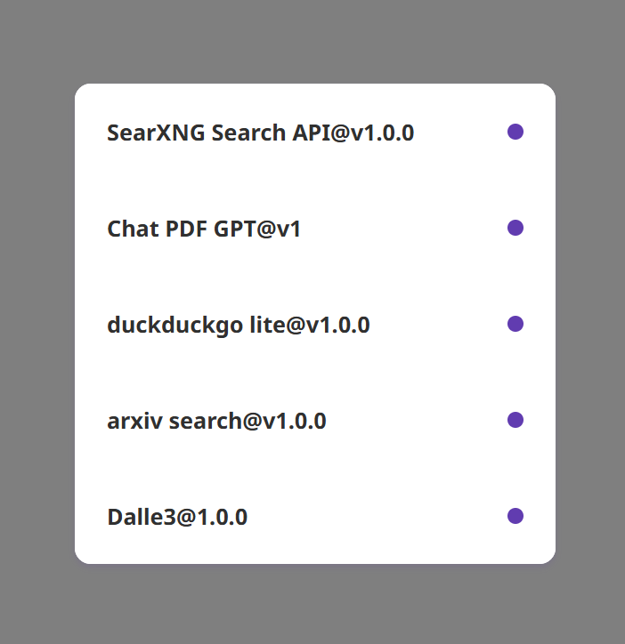

<div align="center">

<a href='#企業版'>
  
</a>

<h1 align="center">GroveChat</h1>

<a href='#企業版'>
  
</a>

Déployez gratuitement votre application Web privée ChatGPT en un seul clic, prenant en charge les modèles GPT3, GPT4 et Gemini Pro.

[GroveChat](https://grove-chat.vercel.app)/[Édition Entreprise](https://grove-chat.vercel.app)/[Démo](https://grove-chat.vercel.app)/[Problèmes de commentaires](https://github.com/robbiedood/grove-chat/issues)

[](https://vercel.com/new/clone?repository-url=https://github.com/robbiedood/grove-chat&env=OPENAI_API_KEY&env=CLERK_SECRET_KEY&env=CLERK_WEBHOOK_SECRET&env=NEXT_PUBLIC_CLERK_PUBLISHABLE_KEY&project-name=grove-chat&repository-name=grove-chat)

</div>

## Table des matières

-   [Édition Entreprise](#企業版)
-   [Caractéristiques](#功能特點)
-   [Commencer](#開始使用)
-   [Configurer le mot de passe d'accès à la page](#配置頁面訪問密碼)
-   [variables d'environnement](#環境變量)
-   [Paramètres du modèle utilisateur](#用戶模型設置)
-   [développement local](#開發)
-   [capture d'écran](#截圖)
-   [Projets associés](#相關項目)
-   [Accord open source](#開源協議)

## Édition Entreprise

Répondez aux besoins de déploiement et de personnalisation privés de votre entreprise

-   **Personnalisation de la marque**: VI/UI adapté à l'entreprise, correspondant parfaitement à l'image de marque de l'entreprise
-   **Intégration des ressources**: Des dizaines de ressources d'IA sont configurées et gérées de manière uniforme par les responsables de l'entreprise, et les membres de l'équipe peuvent les utiliser immédiatement.
-   **Gestion des autorisations**: Les autorisations des membres, les autorisations des ressources et les autorisations de la base de connaissances sont clairement hiérarchiques et unifiées contrôlées par le panneau d'administration au niveau de l'entreprise.
-   **accès aux connaissances**: La combinaison de la base de connaissances interne d'une entreprise et des capacités d'IA est plus proche des besoins commerciaux de l'entreprise que l'IA générale.
-   **audit de sécurité**: interceptez automatiquement les questions sensibles et prenez en charge le traçage de tous les enregistrements historiques des conversations, permettant à l'IA de se conformer également aux réglementations en matière de sécurité des informations de l'entreprise
-   **déploiement privé**: Déploiement privé au niveau de l'entreprise, prenant en charge divers déploiements de cloud privé grand public pour garantir la sécurité des données et la protection de la confidentialité
-   **Mises à jour continues**: Fournir des services de mise à jour et de mise à niveau continues pour des fonctionnalités de pointe telles que la multimodalité et l'intelligence, qui sont fréquemment utilisées et constamment avancées.

Consultation version entreprise :**vide**


## Caractéristiques

-   Déployez sur Vercel gratuitement en un clic et prend moins d'1 minute
-   Client simplifié (~ 5 Mo) pour Linux/Windows/MacOS, téléchargez-le maintenant
-   Entièrement compatible avec LLM auto-déployé, recommandé pour une utilisation avec RWKV-Runner ou LocalAI
-   La confidentialité avant tout, toutes les données sont stockées localement dans le navigateur
-   Support Markdown : LaTex, sirène, surbrillance de code, etc.
-   Conception réactive, prend en charge le mode sombre et PWA
-   Le premier écran se charge rapidement (environ 100 Ko) et prend en charge la réponse en streaming
-   Nouveau dans la v2 : utilisez des modèles d'invite (masque) pour créer, partager et déboguer vos outils de discussion
-   Conseils géniaux propulsés par Awesome-chatgpt-prompts-zh et Awesome-chatgpt-prompts
-   Compressez automatiquement l'historique des discussions pour prendre en charge les longues conversations tout en enregistrant vos jetons
-   Prise en charge multilingue : anglais, chinois simplifié, chinois traditionnel, japonais, français, espagnol, italien, turc, allemand, vietnamien, russe, tchèque, coréen, indonésien

## Commencer

1.  prépare le tien[Clé API OpenAI](https://platform.openai.com/account/api-keys);
2.  Utilisation de Clerk comme gestion des autorisations des utilisateurs[Site officiel du greffier](https://clerk.com/)[Fichier de configuration](https://github.com/robbiedood/grove-chat/tree/main/docs)
3.  Cliquez sur le bouton à droite pour démarrer le déploiement :[](https://vercel.com/new/clone?repository-url=https://github.com/robbiedood/grove-chat&env=OPENAI_API_KEY&env=CLERK_SECRET_KEY&env=CLERK_WEBHOOK_SECRET&env=NEXT_PUBLIC_CLERK_PUBLISHABLE_KEY&project-name=grove-chat&repository-name=grove-chat), connectez-vous simplement directement avec votre compte GitHub. N'oubliez pas de renseigner la clé API et.[Gestion des droits des utilisateurs](#配置訪問權限Clerk)Greffier;
4.  Une fois le déploiement terminé, vous pouvez commencer à l'utiliser ;
5.  (facultatif)[Lier un nom de domaine personnalisé](https://vercel.com/docs/concepts/projects/domains/add-a-domain): Le nom de domaine DNS attribué par Vercel est contaminé dans certaines zones. Liez un nom de domaine personnalisé pour vous connecter directement.

<div align="center">
   


</div>

## Configurer le mot de passe d'accès à la page

> Ce projet a abandonné la variable d'environnement CODE du projet original NextChat et utilise le mot de passe d'accès à la page de gestion des commis. Tutoriel :[Comment configurer le commis](./docs)。


## variables d'environnement

> La plupart des éléments de configuration de ce projet sont définis via des variables d'environnement :[Comment modifier les variables d'environnement Vercel](./docs/vercel-cn.md)。

### `OPENAI_API_KEY`(requis)

Clé OpenAI, la clé API que vous avez demandée sur la page du compte openai, utilisez des virgules anglaises pour séparer plusieurs clés, afin que ces clés puissent être interrogées de manière aléatoire.

### `CLERK_SECRET_KEY`(requis)

Gestion des utilisateurs commis

### `CLERK_WEBHOOK_SECRET`(requis)

Gestion des utilisateurs commis

### `NEXT_PUBLIC_CLERK_PUBLISHABLE_KEY`(requis)

Gestion des utilisateurs commis

### `BASE_URL`(facultatif)

> défaut:`https://api.openai.com`

> Exemple:`http://your-openai-proxy.com`

URL du proxy de l'interface OpenAI, si vous avez configuré manuellement le proxy de l'interface openai, veuillez remplir cette option.

> Si vous rencontrez des problèmes avec le certificat SSL, veuillez le remplacer`BASE_URL`Le protocole est défini sur http.

### `OPENAI_ORG_ID`(facultatif)

Spécifiez l'ID de l'organisation dans OpenAI.

### `AZURE_URL`(facultatif)

> Forme comme : https&#x3A;//{azure-resource-url}/openai

Adresse de déploiement Azure.

### `AZURE_API_KEY`(facultatif)

Clé Azure.

### `AZURE_API_VERSION`(facultatif)

Version de l'API Azure que vous pouvez trouver ici :[Documentation Azure](https://learn.microsoft.com/en-us/azure/ai-services/openai/reference#chat-completions)。

### `GOOGLE_API_KEY`(facultatif)

Clé Google Gemini Pro.

### `GOOGLE_URL`(facultatif)

URL de l'API Google Gemini Pro。

### `ANTHROPIC_API_KEY`(facultatif)

Clé Api Anthropique Claude.

### `ANTHROPIC_API_VERSION`(facultatif)

Version API Anthropique Claude.

### `ANTHROPIC_URL`(facultatif)

Anthropic Claude Api Url。

### `BAIDU_API_KEY`(facultatif)

Clé de feu Baidu.

### `BAIDU_SECRET_KEY`(facultatif)

Clé secrète Baidu.

### `BAIDU_URL`(facultatif)

URL de l'API Baidu.

### `BYTEDANCE_API_KEY`(facultatif)

Clé de feu ByteDance.

### `BYTEDANCE_URL`(facultatif)

URL de l'API ByteDance.

### `ALIBABA_API_KEY`(facultatif)

Clé API Alibaba Cloud (Qianwen).

### `ALIBABA_URL`(facultatif)

URL de l'API Alibaba Cloud (Qianwen).

### `IFLYTEK_URL`(facultatif)

URL de l’API iFlytek Spark.

### `IFLYTEK_API_KEY`(facultatif)

Clé API iFlytek Spark.

### `IFLYTEK_API_SECRET`(facultatif)

Secret de l'API iFlytek Spark.

### `CHATGLM_API_KEY`(facultatif)

Clé API ChatGLM.

### `CHATGLM_URL`(facultatif)

URL de l'API ChatGLM.

### `XAI_API_KEY`(facultatif)

Clé API XAI.

### `XAI_URL`(facultatif)

Salut Api Orl.

### `PERPLEXITY_API_KEY`(facultatif)

Clé API PERPLEXITÉ.

### `PERPLEXITY_URL`(facultatif)

URL de l'API PERPLEXITY.

### `MOONSHOT_API_KEY`(facultatif)

Clé API MOONSHOT.

### `MOONSHOT_URL`(facultatif)

URL de l'API MOONSHOT

### `HIDE_USER_API_KEY`(facultatif)

Si vous ne souhaitez pas que les utilisateurs remplissent eux-mêmes la clé API, définissez simplement cette variable d'environnement sur 1.

### `DISABLE_GPT4`(facultatif)

Si vous ne souhaitez pas que vos utilisateurs utilisent GPT-4, définissez simplement cette variable d'environnement sur 1.

### `ENABLE_BALANCE_QUERY`(facultatif)

Si vous souhaitez activer la fonction de requête de solde, définissez simplement cette variable d'environnement sur 1.

### `DISABLE_FAST_LINK`(facultatif)

Si vous souhaitez désactiver l'analyse des paramètres préfabriqués à partir des liens, définissez cette variable d'environnement sur 1.

### `WHITE_WEBDAV_ENDPOINTS`(facultatif)

Si vous souhaitez ajouter les adresses de service WebDAV auxquelles l'accès est autorisé, vous pouvez utiliser cette option. Les exigences de format sont les suivantes :

-   Chaque adresse doit être un point de terminaison complet
    > `https://xxxx/xxx`
-   plusieurs adresses à`,`connecté

### `CUSTOM_MODELS`(facultatif)

> Exemple:`+qwen-7b-chat,+glm-6b,-gpt-3.5-turbo,gpt-4-1106-preview=gpt-4-turbo`signifie augmenter`qwen-7b-chat`et`glm-6b`à la liste des modèles et supprimer de la liste`gpt-3.5-turbo`, et je le ferai`gpt-4-1106-preview`Le nom du modèle s'affiche sous la forme`gpt-4-turbo`。  
> Si vous souhaitez d'abord désactiver tous les modèles, puis activer des modèles spécifiques, vous pouvez utiliser`-all,+gpt-3.5-turbo`, ce qui signifie uniquement activer`gpt-3.5-turbo`。

Pour contrôler la liste des modèles, utilisez`+`Pour ajouter un modèle, utilisez`-`Pour masquer un modèle, utilisez`模型名=展示名`Afficher les noms pour personnaliser le modèle, séparés par des virgules.

En mode Azure, il est possible d'utiliser`modelName@Azure=deploymentName` 的方式配置模型名稱和部署名稱（deploy-name）。

> Exemple:`+gpt-3.5-turbo@Azure=gpt35`Cette configuration affichera un`gpt35(Azure)`choix.  
> Si vous ne pouvez utiliser que le mode Azure, définissez`-all,+gpt-3.5-turbo@Azure=gpt35`Vous pouvez faire l'utilisation par défaut de la conversation`gpt35(Azure)`。

En mode ByteDance, prend en charge l'utilisation de`modelName@bytedance=deploymentName`Configurez le nom du modèle et le nom du déploiement (nom du déploiement).

> Exemple:`+Doubao-lite-4k@bytedance=ep-xxxxx-xxx`Cette configuration affichera un`Doubao-lite-4k(ByteDance)`choix.

### `DEFAULT_MODEL`(facultatif)

Changez le modèle par défaut.

### `DEFAULT_INPUT_TEMPLATE`(facultatif)

Personnalisez le modèle par défaut, qui est utilisé pour initialiser l'élément de configuration « Prétraitement des entrées utilisateur » dans « Paramètres ».

### `STABILITY_API_KEY`(facultatif)

Clé API de stabilité.

### `STABILITY_URL`(facultatif)

Adresse de demande d'API de stabilité personnalisée.

## Paramètres du modèle utilisateur

se connecter

> La clé API définie par le système peut être utilisée selon la plus haute autorité de l'utilisateur.

Non connecté

> Si vous n'êtes pas connecté, vous pouvez remplir votre propre clé API dans les paramètres du proxy pour utiliser le modèle invité.

Rôle utilisateur après la connexion

> invité

Les autorisations de rôle peuvent être modifiées dans le tableau de bord du commis

> [Tutoriel de configuration du commis](https://github.com/robbiedood/grove-chat/tree/main/docs)

### Ajouter un nouveau modèle

[Fichier de code app/constant.ts](https://github.com/robbiedood/grove-chat/blob/pbooks/app/constant.ts)

Rechercher un fournisseur de modèles pour ajouter un nouveau modèle

    const openaiModels = [
      "gpt-3.5-turbo",
      "gpt-3.5-turbo-1106",
      "gpt-3.5-turbo-0125",
      "gpt-4",
      "gpt-4-0613",
      "gpt-4-32k",
      "gpt-4-32k-0613",
      "gpt-4-turbo",
      "gpt-4-turbo-preview",
      "gpt-4o",
      "gpt-4o-2024-05-13",
      "gpt-4o-2024-08-06",
      "gpt-4o-2024-11-20",
      "chatgpt-4o-latest",
      "gpt-4o-mini",
      "gpt-4o-mini-2024-07-18",
      "gpt-4-vision-preview",
      "gpt-4-turbo-2024-04-09",
      "gpt-4-1106-preview",
      "dall-e-3",
      "o1-mini",
      "o1-preview",
    ];

Gérer les droits d'accès (doit figurer dans la liste des modèles du fournisseur de modèles)

      teacher: [
        "o1-mini",
        "o1-preview",
        "gpt-4o-2024-08-06",
        "gpt-4o-mini",
        "claude-3-sonnet-20240229",
        "claude-3-5-sonnet-20240620",
        "llama-3.1-sonar-small-128k-online",
        "llama-3.1-sonar-large-128k-online",
        "llama-3.1-sonar-huge-128k-online",
        "gemini-1.5-pro-latest",
        "gemini-1.5-flash-latest",
        "moonshot-v1-128k",
        "moonshot-v1-32k",
        "grok-2-1212",
        "grok-2-vision-1212",
      ],

## développer

# Les utilisateurs de Chine continentale peuvent utiliser l'agent fourni avec ce projet pour le développement. Vous pouvez également choisir librement d'autres adresses d'agent.

BASE_URL=<https://b.nextweb.fun/api/proxy>

### développement local

1.  Créez-en un nouveau dans le répertoire racine du projet`.env.local`fichier, remplissez les variables d'environnement :


    OPENAI_API_KEY=<your key here>
    CLERK_SECRET_KEY=<your key here>
    CLERK_WEBHOOK_SECRET=<your key here>
    NEXT_PUBLIC_CLERK_PUBLISHABLE_KEY=<your key here>

2.  Installez Node.js 18 et Yarn, veuillez demander à ChatGPT pour plus de détails ;
3.  mettre en œuvre`yarn install && yarn dev`C'est ça. ⚠️ Remarque : Cette commande est uniquement destinée au développement local, ne l'utilisez pas pour le déploiement !
4.  Si vous souhaitez déployer localement, utilisez`yarn install && yarn build && yarn start`commande, vous pouvez utiliser pm2 pour démoniser le processus afin d'éviter qu'il ne soit tué. Demandez à ChatGPT pour plus de détails.

### Déploiement de conteneurs

> La version de Docker doit être 20 ou supérieure, sinon l'image sera introuvable.

> ⚠️ Remarque : La plupart du temps, la version Docker sera en retard de 1 à 2 jours par rapport à la dernière version, donc l'invite « la mise à jour existe » continuera à apparaître après le déploiement, ce qui est normal.

```shell
docker pull robbiedood/grove-chat

docker run -d -p 3000:3000 \
   -e OPENAI_API_KEY=sk-xxxx \
   -e CLERK_SECRET_KEY=<your key here> \
   -e CLERK_WEBHOOK_SECRET=<your key here> \
   -e NEXT_PUBLIC_CLERK_PUBLISHABLE_KEY=<your key here> \
   robbiedood/grove-chat
```

Vous pouvez également spécifier un proxy :

```shell
docker run -d -p 3000:3000 \
   -e OPENAI_API_KEY=sk-xxxx \
   -e CLERK_SECRET_KEY=<your key here> \
   -e CLERK_WEBHOOK_SECRET=<your key here> \
   -e NEXT_PUBLIC_CLERK_PUBLISHABLE_KEY=<your key here> \
   --net=host \
   -e PROXY_URL=http://127.0.0.1:7890 \
   robbiedood/grove-chat
```

Si votre agent local nécessite un compte et un mot de passe, vous pouvez utiliser :

```shell
-e PROXY_URL="http://127.0.0.1:7890 user password"
```

Si vous devez spécifier d'autres variables d'environnement, veuillez les ajouter vous-même à la commande ci-dessus`-e 環境變量=環境變量值`à préciser.

### déploiement local

Exécutez la commande suivante sur la console :

```shell
bash <(curl -s https://raw.githubusercontent.com/robbiedood/grove-chat/main/scripts/setup.sh)
```

⚠️ Remarque : Si vous rencontrez des problèmes lors de l'installation, veuillez utiliser le déploiement Docker.

## capture d'écran





### Projets associés

-   [ChatGPT-Next-Web](https://github.com/ChatGPTNextWeb/ChatGPT-Next-Web):
    Une plate-forme unique de grands modèles qui prend en charge tous les principaux modèles de langages de grande taille du marché.

-   [une API](https://github.com/songquanpeng/one-api): Une plate-forme unique de gestion des quotas de grands modèles qui prend en charge tous les grands modèles linguistiques courants du marché.

-   [M.-Ranedeer Tuteur IA](https://github.com/JushBJJ/Mr.-Ranedeer-AI-Tutor):AI-Tutor

## Accord open source

[AVEC](https://opensource.org/license/mit/)
