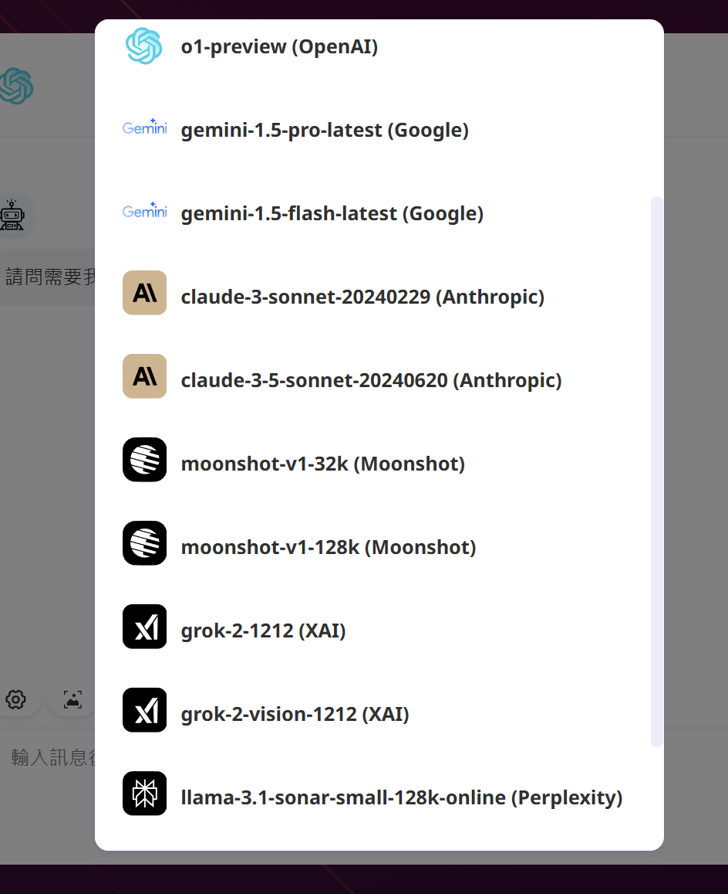

<div align="center">

<a href='#企業版'>
  
</a>

<h1 align="center">GroveChat</h1>

<a href='#企業版'>
  
</a>

GPT3, GPT4 और जेमिनी प्रो मॉडल का समर्थन करते हुए, एक क्लिक के साथ अपने निजी ChatGPT वेब एप्लिकेशन को निःशुल्क तैनात करें।

[ग्रोवचैट](https://grove-chat.vercel.app)/[एंटरप्राइज़ संस्करण](https://grove-chat.vercel.app)/[डेमो](https://grove-chat.vercel.app)/[प्रतिक्रिया मुद्दे](https://github.com/robbiedood/grove-chat/issues)

[](https://vercel.com/new/clone?repository-url=https://github.com/robbiedood/grove-chat&env=OPENAI_API_KEY&env=CLERK_SECRET_KEY&env=CLERK_WEBHOOK_SECRET&env=NEXT_PUBLIC_CLERK_PUBLISHABLE_KEY&project-name=grove-chat&repository-name=grove-chat)

</div>

## विषयसूची

-   [एंटरप्राइज़ संस्करण](#企業版)
-   [विशेषताएँ](#功能特點)
-   [शुरू हो जाओ](#開始使用)
-   [पेज एक्सेस पासवर्ड कॉन्फ़िगर करें](#配置頁面訪問密碼)
-   [環境變量](#環境變量)
-   [उपयोगकर्ता मॉडल सेटिंग्स](#用戶模型設置)
-   [स्थानीय विकास](#開發)
-   [स्क्रीनशॉट](#截圖)
-   [संबंधित परियोजनाएं](#相關項目)
-   [खुला स्रोत समझौता](#開源協議)

## एंटरप्राइज़ संस्करण

अपनी कंपनी की निजी तैनाती और अनुकूलन आवश्यकताओं को पूरा करें

-   **ब्रांड अनुकूलन**: एंटरप्राइज-अनुरूप VI/UI, कॉर्पोरेट ब्रांड छवि से सहजता से मेल खाता है
-   **संसाधन एकीकरण**: दर्जनों एआई संसाधनों को एंटरप्राइज़ प्रबंधकों द्वारा समान रूप से कॉन्फ़िगर और प्रबंधित किया जाता है, और टीम के सदस्य उन्हें बॉक्स से बाहर उपयोग कर सकते हैं
-   **अनुमति प्रबंधन**: सदस्य अनुमतियाँ, संसाधन अनुमतियाँ और ज्ञान आधार अनुमतियाँ स्पष्ट रूप से पदानुक्रमित और एकीकृत हैं जिन्हें एंटरप्राइज़-स्तरीय व्यवस्थापक पैनल द्वारा नियंत्रित किया जाता है
-   **ज्ञान पहुंच**: किसी उद्यम के आंतरिक ज्ञान आधार और एआई क्षमताओं का संयोजन सामान्य एआई की तुलना में उद्यम की अपनी व्यावसायिक आवश्यकताओं के करीब है।
-   **सुरक्षा लेखापरीक्षा**: संवेदनशील प्रश्नों को स्वचालित रूप से रोकें और सभी ऐतिहासिक वार्तालाप रिकॉर्डों का पता लगाने में सहायता करें, जिससे AI कॉर्पोरेट सूचना सुरक्षा नियमों का भी अनुपालन कर सके
-   **निजी तैनाती**: एंटरप्राइज़-स्तरीय निजी परिनियोजन, डेटा सुरक्षा और गोपनीयता सुरक्षा सुनिश्चित करने के लिए विभिन्न मुख्यधारा के निजी क्लाउड परिनियोजन का समर्थन करता है
-   **लगातार अपडेट**: मल्टी-मॉडैलिटी और इंटेलिजेंस जैसी अत्याधुनिक क्षमताओं के लिए निरंतर अद्यतन और उन्नयन सेवाएं प्रदान करें, जिनका अक्सर उपयोग किया जाता है और लगातार उन्नत किया जाता है।

एंटरप्राइज़ संस्करण परामर्श:**खाली**


## विशेषताएँ

-   वर्सेल पर एक क्लिक से निःशुल्क परिनियोजन करें और इसमें 1 मिनट से भी कम समय लगता है
-   Linux/Windows/MacOS के लिए सुव्यवस्थित क्लाइंट (~5MB), अभी डाउनलोड करें
-   स्व-तैनात एलएलएम के साथ पूरी तरह से संगत, आरडब्ल्यूकेवी-रनर या लोकलएआई के साथ उपयोग के लिए अनुशंसित
-   गोपनीयता सबसे पहले, सारा डेटा ब्राउज़र में स्थानीय रूप से संग्रहीत होता है
-   समर्थन मार्कडाउन: लाटेक्स, मरमेड, कोड हाइलाइटिंग, आदि।
-   रिस्पॉन्सिव डिज़ाइन, डार्क मोड और PWA का समर्थन करता है
-   पहली स्क्रीन तेजी से लोड होती है (लगभग 100kb) और स्ट्रीमिंग प्रतिक्रिया का समर्थन करती है
-   v2 में नया: अपने चैट टूल बनाने, साझा करने और डीबग करने के लिए प्रॉम्प्ट टेम्प्लेट (मास्क) का उपयोग करें
-   अद्भुत-चैटजीपीटी-प्रॉम्प्ट्स-ज़ेडएच और अद्भुत-चैटजीपीटी-प्रॉम्प्ट्स द्वारा संचालित अद्भुत युक्तियाँ
-   अपने टोकन सहेजते समय लंबी बातचीत का समर्थन करने के लिए चैट इतिहास को स्वचालित रूप से संपीड़ित करें
-   बहुभाषी समर्थन: अंग्रेजी, सरलीकृत चीनी, पारंपरिक चीनी, जापानी, फ्रेंच, स्पेनिश, इतालवी, तुर्की, जर्मन, वियतनामी, रूसी, चेक, कोरियाई, इंडोनेशियाई

## शुरू हो जाओ

1.  अपना तैयार करो[ओपनएआई एपीआई कुंजी](https://platform.openai.com/account/api-keys);
2.  उपयोगकर्ता अनुमति प्रबंधन के रूप में क्लर्क का उपयोग करना[क्लर्क आधिकारिक वेबसाइट](https://clerk.com/)[कॉन्फ़िगरेशन फ़ाइल](https://github.com/robbiedood/grove-chat/tree/main/docs)
3.  परिनियोजन प्रारंभ करने के लिए दाईं ओर स्थित बटन पर क्लिक करें:[](https://vercel.com/new/clone?repository-url=https://github.com/robbiedood/grove-chat&env=OPENAI_API_KEY&env=CLERK_SECRET_KEY&env=CLERK_WEBHOOK_SECRET&env=NEXT_PUBLIC_CLERK_PUBLISHABLE_KEY&project-name=grove-chat&repository-name=grove-chat), बस अपने GitHub खाते से सीधे लॉग इन करें और एपीआई कुंजी भरना याद रखें[उपयोगकर्ता अधिकार प्रबंधन](#配置訪問權限Clerk)लिपिक;
4.  परिनियोजन पूरा होने के बाद, आप इसका उपयोग शुरू कर सकते हैं;
5.  (वैकल्पिक)[एक कस्टम डोमेन नाम बाइंड करें](https://vercel.com/docs/concepts/projects/domains/add-a-domain): वर्सेल द्वारा निर्दिष्ट डोमेन नाम DNS कुछ क्षेत्रों में सीधे कनेक्ट करने के लिए एक कस्टम डोमेन नाम से जुड़ा हुआ है।

<div align="center">
   


</div>

## पेज एक्सेस पासवर्ड कॉन्फ़िगर करें

> इस प्रोजेक्ट ने मूल प्रोजेक्ट नेक्स्टचैट के कोड पर्यावरण चर को छोड़ दिया है और क्लर्क प्रबंधन पेज एक्सेस पासवर्ड का उपयोग करता है। ट्यूटोरियल:[क्लर्क को कैसे कॉन्फ़िगर करें](./docs)。


## पर्यावरण चर

> इस प्रोजेक्ट में अधिकांश कॉन्फ़िगरेशन आइटम पर्यावरण चर के माध्यम से सेट किए गए हैं:[वर्सेल पर्यावरण चर को कैसे संशोधित करें](./docs/vercel-cn.md)。

### `OPENAI_API_KEY`(आवश्यक)

OpenAI कुंजी, वह API कुंजी जिसके लिए आपने openai खाता पृष्ठ पर आवेदन किया था, कई कुंजियों को अलग करने के लिए अंग्रेजी अल्पविराम का उपयोग करें, ताकि इन कुंजियों को यादृच्छिक रूप से चुना जा सके।

### `CLERK_SECRET_KEY`(आवश्यक)

क्लर्क उपयोगकर्ता प्रबंधन

### `CLERK_WEBHOOK_SECRET`(आवश्यक)

क्लर्क उपयोगकर्ता प्रबंधन

### `NEXT_PUBLIC_CLERK_PUBLISHABLE_KEY`(आवश्यक)

क्लर्क उपयोगकर्ता प्रबंधन

### `BASE_URL`(वैकल्पिक)

> गलती करना:`https://api.openai.com`

> उदाहरण:`http://your-openai-proxy.com`

OpenAI इंटरफ़ेस प्रॉक्सी URL, यदि आपने मैन्युअल रूप से openai इंटरफ़ेस प्रॉक्सी कॉन्फ़िगर किया है, तो कृपया इस विकल्प को भरें।

> यदि आपको एसएसएल प्रमाणपत्र के साथ कोई समस्या है, तो कृपया बदलें`BASE_URL`प्रोटोकॉल http पर सेट है.

### `OPENAI_ORG_ID`(वैकल्पिक)

OpenAI में संगठन आईडी निर्दिष्ट करें।

### `AZURE_URL`(वैकल्पिक)

> आकार इस प्रकार है: https&#x3A;//{azure-resource-url}/openai

Azure परिनियोजन पता.

### `AZURE_API_KEY`(वैकल्पिक)

नीला कुंजी.

### `AZURE_API_VERSION`(वैकल्पिक)

Azure API संस्करण आप यहां पा सकते हैं:[नीला दस्तावेज़ीकरण](https://learn.microsoft.com/en-us/azure/ai-services/openai/reference#chat-completions)。

### `GOOGLE_API_KEY`(वैकल्पिक)

गूगल जेमिनी प्रो कुंजी.

### `GOOGLE_URL`(वैकल्पिक)

Google जेमिनी प्रो एपीआई यूआरएल。

### `ANTHROPIC_API_KEY`(वैकल्पिक)

एंथ्रोपिक क्लाउड एपीआई कुंजी。

### `ANTHROPIC_API_VERSION`(वैकल्पिक)

एंथ्रोपिक क्लाउड एपीआई संस्करण।

### `ANTHROPIC_URL`(वैकल्पिक)

एंथ्रोपिक क्लाउड एपीआई यूआरएल。

### `BAIDU_API_KEY`(वैकल्पिक)

Baidu फायर कुंजी。

### `BAIDU_SECRET_KEY`(वैकल्पिक)

Baidu गुप्त कुंजी。

### `BAIDU_URL`(वैकल्पिक)

Baidu Api Url。

### `BYTEDANCE_API_KEY`(वैकल्पिक)

बाइटडांस फायर की。

### `BYTEDANCE_URL`(वैकल्पिक)

बाइटडांस एपीआई यूआरएल。

### `ALIBABA_API_KEY`(वैकल्पिक)

अलीबाबा क्लाउड (कियानवेन) एपीआई कुंजी।

### `ALIBABA_URL`(वैकल्पिक)

अलीबाबा क्लाउड (कियानवेन) एपीआई यूआरएल।

### `IFLYTEK_URL`(वैकल्पिक)

iFlytek स्पार्क एपीआई यूआरएल।

### `IFLYTEK_API_KEY`(वैकल्पिक)

iFlytek स्पार्क एपीआई कुंजी।

### `IFLYTEK_API_SECRET`(वैकल्पिक)

iFlytek स्पार्क एपीआई रहस्य।

### `CHATGLM_API_KEY`(वैकल्पिक)

चैटजीएलएम एपीआई कुंजी。

### `CHATGLM_URL`(वैकल्पिक)

चैटजीएलएम एपीआई यूआरएल。

### `XAI_API_KEY`(वैकल्पिक)

XAI एपीआई कुंजी。

### `XAI_URL`(वैकल्पिक)

हाय एपीआई Orl.

### `PERPLEXITY_API_KEY`(वैकल्पिक)

व्याकुलता एपीआई कुंजी。

### `PERPLEXITY_URL`(वैकल्पिक)

PERPLEXITY एपीआई यूआरएल。

### `MOONSHOT_API_KEY`(वैकल्पिक)

मूनशॉट एपीआई कुंजी。

### `MOONSHOT_URL`(वैकल्पिक)

मूनशॉट एपीआई यूआरएल

### `HIDE_USER_API_KEY`(वैकल्पिक)

यदि आप नहीं चाहते कि उपयोगकर्ता स्वयं एपीआई कुंजी भरें, तो बस इस पर्यावरण चर को 1 पर सेट करें।

### `DISABLE_GPT4`(वैकल्पिक)

यदि आप नहीं चाहते कि आपके उपयोगकर्ता GPT-4 का उपयोग करें, तो बस इस पर्यावरण चर को 1 पर सेट करें।

### `ENABLE_BALANCE_QUERY`(वैकल्पिक)

यदि आप बैलेंस क्वेरी फ़ंक्शन को सक्षम करना चाहते हैं, तो बस इस पर्यावरण चर को 1 पर सेट करें।

### `DISABLE_FAST_LINK`(वैकल्पिक)

यदि आप लिंक से पार्सिंग प्रीफ़ैब सेटिंग्स को अक्षम करना चाहते हैं, तो इस पर्यावरण चर को 1 पर सेट करें।

### `WHITE_WEBDAV_ENDPOINTS`(वैकल्पिक)

यदि आप WebDAV सेवा पते जोड़ना चाहते हैं जिन्हें एक्सेस करने की अनुमति है, तो आप इस विकल्प का उपयोग कर सकते हैं प्रारूप आवश्यकताएँ हैं:

-   प्रत्येक पता एक पूर्ण समापन बिंदु होना चाहिए
    > `https://xxxx/xxx`
-   के लिए अनेक पते`,`जुड़े हुए

### `CUSTOM_MODELS`(वैकल्पिक)

> उदाहरण:`+qwen-7b-chat,+glm-6b,-gpt-3.5-turbo,gpt-4-1106-preview=gpt-4-turbo`मतलब वृद्धि`qwen-7b-chat`और`glm-6b`मॉडल सूची में डालें और सूची से हटा दें`gpt-3.5-turbo`, और करेंगे`gpt-4-1106-preview`मॉडल का नाम इस प्रकार प्रदर्शित होता है`gpt-4-turbo`。  
> यदि आप पहले सभी मॉडलों को अक्षम करना चाहते हैं और फिर विशिष्ट मॉडलों को सक्षम करना चाहते हैं, तो आप इसका उपयोग कर सकते हैं`-all,+gpt-3.5-turbo`, जिसका अर्थ केवल सक्षम करना है`gpt-3.5-turbo`。

मॉडल सूची को नियंत्रित करने के लिए, उपयोग करें`+`एक मॉडल जोड़ने के लिए, उपयोग करें`-`किसी मॉडल को छिपाने के लिए, उपयोग करें`模型名=展示名`मॉडल को अनुकूलित करने के लिए अल्पविराम द्वारा अलग किए गए नाम प्रदर्शित करें।

Azure मोड में, इसका उपयोग समर्थित है`modelName@Azure=deploymentName`मॉडल नाम और परिनियोजन नाम (परिनियोजन-नाम) कॉन्फ़िगर करें।

> उदाहरण:`+gpt-3.5-turbo@Azure=gpt35`यह कॉन्फ़िगरेशन एक प्रदर्शित करेगा`gpt35(Azure)`विकल्प.  
> यदि आप केवल Azure मोड का उपयोग कर सकते हैं, तो सेट करें`-all,+gpt-3.5-turbo@Azure=gpt35`आप वार्तालाप का डिफ़ॉल्ट उपयोग कर सकते हैं`gpt35(Azure)`。

बाइटडांस मोड में, के उपयोग का समर्थन करें`modelName@bytedance=deploymentName`मॉडल नाम और परिनियोजन नाम (परिनियोजन-नाम) कॉन्फ़िगर करें।

> उदाहरण:`+Doubao-lite-4k@bytedance=ep-xxxxx-xxx`यह कॉन्फ़िगरेशन एक प्रदर्शित करेगा`Doubao-lite-4k(ByteDance)`विकल्प.

### `DEFAULT_MODEL`(वैकल्पिक)

डिफ़ॉल्ट मॉडल बदलें.

### `DEFAULT_INPUT_TEMPLATE`(वैकल्पिक)

डिफ़ॉल्ट टेम्पलेट को कस्टमाइज़ करें, जिसका उपयोग "सेटिंग्स" में "यूज़र इनपुट प्रीप्रोसेसिंग" कॉन्फ़िगरेशन आइटम को प्रारंभ करने के लिए किया जाता है।

### `STABILITY_API_KEY`(वैकल्पिक)

स्थिरता एपीआई कुंजी.

### `STABILITY_URL`(वैकल्पिक)

अनुकूलित स्थिरता एपीआई अनुरोध पता।

## उपयोगकर्ता मॉडल सेटिंग्स

लॉग इन करें

> सिस्टम द्वारा निर्धारित एपीआई कुंजी का उपयोग उपयोगकर्ता के उच्चतम प्राधिकारी के अनुसार किया जा सकता है।

अंदर प्रवेश की अनुमति नहीं है

> यदि आप लॉग इन नहीं हैं, तो आप अतिथि मॉडल का उपयोग करने के लिए प्रॉक्सी सेटिंग्स में अपनी एपीआई कुंजी भर सकते हैं।

लॉगिन के बाद उपयोगकर्ता की भूमिका

> अतिथि

भूमिका अनुमतियाँ क्लर्क डैशबोर्ड में बदली जा सकती हैं

> [क्लर्क कॉन्फ़िगरेशन ट्यूटोरियल](https://github.com/robbiedood/grove-chat/tree/main/docs)

### नया मॉडल जोड़ें

[कोड फ़ाइल ऐप/constant.ts](https://github.com/robbiedood/grove-chat/blob/pbooks/app/constant.ts)

नया मॉडल जोड़ने के लिए मॉडल आपूर्तिकर्ता ढूंढें

    const openaiModels = [
      "gpt-3.5-turbo",
      "gpt-3.5-turbo-1106",
      "gpt-3.5-turbo-0125",
      "gpt-4",
      "gpt-4-0613",
      "gpt-4-32k",
      "gpt-4-32k-0613",
      "gpt-4-turbo",
      "gpt-4-turbo-preview",
      "gpt-4o",
      "gpt-4o-2024-05-13",
      "gpt-4o-2024-08-06",
      "gpt-4o-2024-11-20",
      "chatgpt-4o-latest",
      "gpt-4o-mini",
      "gpt-4o-mini-2024-07-18",
      "gpt-4-vision-preview",
      "gpt-4-turbo-2024-04-09",
      "gpt-4-1106-preview",
      "dall-e-3",
      "o1-mini",
      "o1-preview",
    ];

पहुंच अधिकार प्रबंधित करें (मॉडल आपूर्तिकर्ता की मॉडल सूची में होना चाहिए)

      teacher: [
        "o1-mini",
        "o1-preview",
        "gpt-4o-2024-08-06",
        "gpt-4o-mini",
        "claude-3-sonnet-20240229",
        "claude-3-5-sonnet-20240620",
        "llama-3.1-sonar-small-128k-online",
        "llama-3.1-sonar-large-128k-online",
        "llama-3.1-sonar-huge-128k-online",
        "gemini-1.5-pro-latest",
        "gemini-1.5-flash-latest",
        "moonshot-v1-128k",
        "moonshot-v1-32k",
        "grok-2-1212",
        "grok-2-vision-1212",
      ],

## विकास करना

# मुख्य भूमि चीन में उपयोगकर्ता विकास के लिए इस परियोजना के साथ आने वाले एजेंट का उपयोग कर सकते हैं। आप स्वतंत्र रूप से अन्य एजेंट पते भी चुन सकते हैं।

बेस\_यूआरएल=<https://b.nextweb.fun/api/proxy>

### स्थानीय विकास

1.  प्रोजेक्ट रूट डायरेक्टरी में एक नया बनाएं`.env.local`फ़ाइल, पर्यावरण चर भरें:


    OPENAI_API_KEY=<your key here>
    CLERK_SECRET_KEY=<your key here>
    CLERK_WEBHOOK_SECRET=<your key here>
    NEXT_PUBLIC_CLERK_PUBLISHABLE_KEY=<your key here>

2.  Node.js 18 और Yarn स्थापित करें, कृपया विवरण के लिए ChatGPT से पूछें;
3.  अमल में लाना`yarn install && yarn dev`इतना ही। ⚠️ नोट: यह कमांड केवल स्थानीय विकास के लिए है, इसे परिनियोजन के लिए उपयोग न करें!
4.  यदि आप स्थानीय रूप से तैनात करना चाहते हैं, तो उपयोग करें`yarn install && yarn build && yarn start`आदेश, आप प्रक्रिया को ख़त्म होने से बचाने के लिए pm2 का उपयोग कर सकते हैं, विवरण के लिए ChatGPT से पूछें।

### कंटेनर परिनियोजन

> डॉकर संस्करण 20 या उससे ऊपर का होना चाहिए, अन्यथा यह संकेत देगा कि छवि नहीं मिल सकती है।

> ⚠️ नोट: अधिकांश समय, डॉकर संस्करण नवीनतम संस्करण से 1 से 2 दिन पीछे रहेगा, इसलिए तैनाती के बाद "अपडेट मौजूद है" संकेत दिखाई देता रहेगा, जो सामान्य है।

```shell
docker pull robbiedood/grove-chat

docker run -d -p 3000:3000 \
   -e OPENAI_API_KEY=sk-xxxx \
   -e CLERK_SECRET_KEY=<your key here> \
   -e CLERK_WEBHOOK_SECRET=<your key here> \
   -e NEXT_PUBLIC_CLERK_PUBLISHABLE_KEY=<your key here> \
   robbiedood/grove-chat
```

आप एक प्रॉक्सी भी निर्दिष्ट कर सकते हैं:

```shell
docker run -d -p 3000:3000 \
   -e OPENAI_API_KEY=sk-xxxx \
   -e CLERK_SECRET_KEY=<your key here> \
   -e CLERK_WEBHOOK_SECRET=<your key here> \
   -e NEXT_PUBLIC_CLERK_PUBLISHABLE_KEY=<your key here> \
   --net=host \
   -e PROXY_URL=http://127.0.0.1:7890 \
   robbiedood/grove-chat
```

यदि आपके स्थानीय एजेंट को खाते और पासवर्ड की आवश्यकता है, तो आप इसका उपयोग कर सकते हैं:

```shell
-e PROXY_URL="http://127.0.0.1:7890 user password"
```

यदि आपको अन्य पर्यावरण चर निर्दिष्ट करने की आवश्यकता है, तो कृपया उन्हें उपरोक्त कमांड में स्वयं जोड़ें`-e 環境變量=環境變量值`स्पष्ट रूप से बताने के लिए।

### स्थानीय तैनाती

कंसोल पर निम्न कमांड चलाएँ:

```shell
bash <(curl -s https://raw.githubusercontent.com/robbiedood/grove-chat/main/scripts/setup.sh)
```

⚠️ नोट: यदि आपको इंस्टॉलेशन के दौरान समस्या आती है, तो कृपया डॉकर परिनियोजन का उपयोग करें।

## स्क्रीनशॉट




### संबंधित परियोजनाएं

-   [चैटजीपीटी-नेक्स्ट-वेब](https://github.com/ChatGPTNextWeb/ChatGPT-Next-Web):
    एक वन-स्टॉप बड़ा मॉडल प्लेटफ़ॉर्म जो बाज़ार में सभी प्रमुख बड़े भाषा मॉडल का समर्थन करता है।

-   [एक एपीआई](https://github.com/songquanpeng/one-api): एक वन-स्टॉप बड़े मॉडल कोटा प्रबंधन प्लेटफ़ॉर्म जो बाज़ार में सभी मुख्यधारा के बड़े भाषा मॉडल का समर्थन करता है।

-   [श्री-रानीडीर एआई ट्यूटर](https://github.com/JushBJJ/Mr.-Ranedeer-AI-Tutor):एआई-ट्यूटर

## खुला स्रोत समझौता

[साथ](https://opensource.org/license/mit/)
