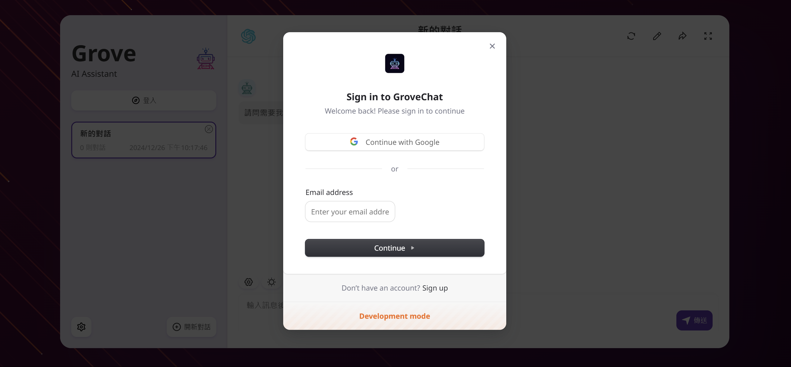

<div align="center">

[英語](./README.en.md)\|[単純化された中国人](./README.zh-CN.md)\|[アラビア語](./README.ar.md)\|[フランス語](./README.fr.md)\|[日本語](./README.ja.md)

</div>
<div align="center">
  <h1>GroveChat</h1>
  <a href='#企業版'>
    
  </a>

  <p>一鍵免費部署你的私人 ChatGPT 網頁應用，支持 GPT3、GPT4 和 Gemini Pro 模型。</p>

  <p>
    <a href="https://grove-chat.vercel.app">GroveChat</a> / 
    <a href="https://grove-chat.vercel.app">企業版</a> / 
    <a href="https://grove-chat.vercel.app">演示 Demo</a> / 
    <a href="https://github.com/robbiedood/grove-chat/issues">反饋 Issues</a>
  </p>

  <a href="https://vercel.com/new/clone?repository-url=https://github.com/robbiedood/grove-chat&env=OPENAI_API_KEY&env=CLERK_SECRET_KEY&env=CLERK_WEBHOOK_SECRET&env=NEXT_PUBLIC_CLERK_PUBLISHABLE_KEY&project-name=grove-chat&repository-name=grove-chat">
    
  </a>
</div>

## 目次

-   [企業版](#企業版)
-   [機能的特徴](#功能特點)
-   [開始使用](#開始使用)
-   [ページアクセスパスワードを構成します](#配置頁面訪問密碼)
-   [環境変数](#環境變量)
-   [ユーザーモデル設定](#用戶模型設置)
-   [ローカル開発](#開發)
-   [スクリーンショット](#截圖)
-   [関連プロジェクト](#相關項目)
-   [オープンソースプロトコル](#開源協議)
-   [説明の変更](./CHANGELOG.md)

## 企業版

あなたの会社の民営化の展開とカスタマイズのニーズを満たしてください

-   **ブランドのカスタマイズ**：企業向けのカスタマイズされたVI/UIは、コーポレートブランドイメージにシームレスに適合します
-   **資源集成**：エンタープライズマネージャーは、数十のAIリソースを均一に構成および管理し、チームメンバーは箱から出して使用できます
-   **許可管理**：メンバーの権限、リソース許可、および知識ベースの権限が明確に定義されており、エンタープライズレベルの管理パネル統一コントロールが明確に定義されています
-   **知識アクセス**：エンタープライズの内部知識ベースは、一般的なAIよりも企業自身のビジネスニーズに近いAI機能と組み合わされています。
-   **セキュリティ監査**：AIがエンタープライズ情報セキュリティの仕様に従うことができるように、すべての歴史的対話記録のトレースをサポートし、機密性の高い質問を自動的に傍受します
-   **プライベート展開**：エンタープライズレベルのプライベート展開、さまざまな主流のプライベートクラウドの展開をサポートし、データセキュリティとプライバシー保護の確保
-   **継続的な更新**：マルチモーダルやエージェントなどの最先端の機能を継続的に更新およびアップグレードするためのサービスを提供し、常に新しく継続的に高度です。

エンタープライズエディションの相談：**空の**


## 機能的特徴

-   1分未満で無料でVercelに展開
-   Linux/Windows/MacOSのLiteクライアント（約5MB）、今すぐダウンロードしてください
-   自己展開されたLLMと完全に互換性があり、RWKVランナーまたはローカリで使用することをお勧めします
-   プライバシーが推奨され、すべてのデータはローカルブラウザに保存されます
-   サポートマークダウン：ラテックス、人魚、コードハイライトなど。
-   レスポンシブデザイン、ダークモードおよびPWAのサポート
-   最初の画面は高速（約100 kb）にロードされ、ストリーミング応答をサポートします
-   V2新機能：プロンプトテンプレート（マスク）を使用してチャットツールを作成、共有、デバッグ
-   チャット履歴を自動的に圧縮して、トークンを保存しながら長い会話をサポートします
-   多言語のサポート：英語、単純化された中国語、伝統的な中国語、日本、フランス語、スペイン語、イタリア語、トルコ語、ドイツ語、ベトナム、ロシア語、チェコ、韓国語、インドネシア語

## 開始使用

1.  あなたの準備をしてください[Openai APIキー](https://platform.openai.com/account/api-keys);
2.  ユーザー許可管理として店員を使用します[書記官の公式ウェブサイト](https://clerk.com/)[構成ファイル](#配置頁面訪問密碼)
3.  右側のボタンをクリックして、展開を開始します。[](https://vercel.com/new/clone?repository-url=https://github.com/robbiedood/grove-chat&env=OPENAI_API_KEY&env=CLERK_SECRET_KEY&env=CLERK_WEBHOOK_SECRET&env=NEXT_PUBLIC_CLERK_PUBLISHABLE_KEY&project-name=grove-chat&repository-name=grove-chat)、GitHubアカウントを使用してログインするだけで、APIキーに記入してください。[ユーザー許可管理](#配置訪問權限Clerk)店員;
4.  展開が完了したら、使用を開始できます。
5.  （可選）[カスタムドメイン名をバインドします](https://vercel.com/docs/concepts/projects/domains/add-a-domain)：Vercel-Assignedドメイン名DNSは一部の領域で汚染されているため、バインディングしてカスタムドメイン名に直接接続できます。

<div align="center">
   


</div>

## ページアクセスパスワードを構成します

> このプロジェクトは、元のプロジェクトNextChatのコード環境変数を非難し、Clerk Managementページを使用してパスワードにアクセスしました。
>
> ### ステップ1：店員アカウントを登録します
>
> 行く[書記官の公式ウェブサイト](https://clerk.com/)、アカウントを登録してログインします。ログインしたら、クリックします**アプリケーションを作成します**（アプリケーションを作成）。


### ステップ2：ログインオプションを選択します

有効にする**メール**（必要）和**グーグル**（選択）オプション、下の図に示すように。


### ステップ3：APIキーを取得します

あなたを見つけてください`NEXT_PUBLIC_CLERK_PUBLISHABLE_KEY`そして`CLERK_SECRET_KEY`。それらを追加します`.env`以下に示すように、アーカイブで：

```env
NEXT_PUBLIC_CLERK_PUBLISHABLE_KEY=你的公開金鑰
CLERK_SECRET_KEY=你的密鑰
```


### ステップ4：電子メールとパスワードを構成します

行く**configure> email、電話、ユーザー名**（構成>電子メール、電話、ユーザー名）、必ず有効にしてください**メール**（電子メール）、**パスワード**（パスワード）および**電子メール検証コード**（電子メール検証コード）。


### ステップ5：役割と権限を構成します

下の図に示すように、役割と権限を設定します。


### ステップ6：一般的な設定

行く**configure> settings**（構成>設定）、次の図に示すようにオプションを設定します。


### ステップ7：WebHookを構成します

WebHookエンドポイントをリスニングURLに設定します。クリック**署名秘密**（署名キー）あなたを見る`CLERK_WEBHOOK_SECRET`そしてそれを追加します`.env`ファイル：

```env
CLERK_WEBHOOK_SECRET=你的webhook密鑰
```


### ステップ8：ユーザーを作成します

必要に応じてユーザーアカウントを作成します。


### ステップ9：組織を構築します

組織を作成し、開発者のメールアドレスを追加します。彼らの役割をに設定します**教師**（教師）。

## マルチマニストレーターグローブアプリケーションを管理します

### ステップ1：組織を構築します

左上隅をクリックします**組織を作成します**（組織の構築）。

### ステップ2：所有権を転送します

行く**configure> settings**（構成>設定）、クリックします**所有権を転送します**（所有権の譲渡）。新しい所有者を構築したばかりの組織に設定します。


### ステップ3：他のユーザーを追加します

左上隅をクリックします**管理**（管理）他のユーザーを追加し、管理権の権利を付与する。




## 環境変数

> このプロジェクトのほとんどの構成項目は、環境変数を介して設定されています。[Vercel環境変数を変更する方法](./docs/vercel-cn.md)。

### `OPENAI_API_KEY`（必須）

OpenAIアカウントページで申請するAPIキーであるOpenaiキーは、英語のコンマを使用して複数のキーを分離して、これらのキーをランダムにポーリングできるようにします。

### `CLERK_SECRET_KEY`（必須）

書記官ユーザー管理

### `CLERK_WEBHOOK_SECRET`（必須）

書記官ユーザー管理

### `NEXT_PUBLIC_CLERK_PUBLISHABLE_KEY`（必須）

書記官ユーザー管理

### `BASE_URL`（可選）

> デフォルト：`https://api.openai.com`

> 例：`http://your-openai-proxy.com`

OpenAIインターフェイスプロキシURL、OpenAIインターフェイスプロキシを手動で構成する場合は、このオプションを入力してください。

> SSL証明書の問題が発生した場合は、ターンしてください`BASE_URL`的協議設置為 http。

### `OPENAI_ORG_ID`（可選）

指定 OpenAI 中的組織 ID。

### `AZURE_URL`（可選）

> 例：https：// {azure-resource-url}/openai

Azureの展開アドレス。

### `AZURE_API_KEY`（可選）

Azureキー。

### `AZURE_API_VERSION`（可選）

Azure APIバージョンでは、ここで見つけることができます：[Azureドキュメント](https://learn.microsoft.com/en-us/azure/ai-services/openai/reference#chat-completions)。

### `GOOGLE_API_KEY`(可選)

Google Gemini Proキー。

### `GOOGLE_URL`(可選)

Google Gemini Pro API URL。

### `ANTHROPIC_API_KEY`(可選)

人類のクロードAPIキー。

### `ANTHROPIC_API_VERSION`(可選)

人類のクロードAPIバージョン。

### `ANTHROPIC_URL`(可選)

人為的クロードAPI URL

### `BAIDU_API_KEY`(可選)

Baidu APIキー。

### `BAIDU_SECRET_KEY`(可選)

Baidu Secret Key。

### `BAIDU_URL`(可選)

bedu api url。

### `BYTEDANCE_API_KEY`(可選)

南に態度を落とすブレンチー。

### `BYTEDANCE_URL`(可選)

bytedance api url。

### `ALIBABA_API_KEY`(可選)

Alibaba Cloud（Qianwen）APIキー。

### `ALIBABA_URL`(可選)

Alibaba Cloud（QIANQU）API URL。

### `IFLYTEK_URL`(可選)

iflytek api url。

### `IFLYTEK_API_KEY`(可選)

iflytek APIキー。

### `IFLYTEK_API_SECRET`(可選)

iflytek APIシークレット。

### `CHATGLM_API_KEY`(可選)

chatglm apiキー。

### `CHATGLM_URL`(可選)

chatglm api url。

### `XAI_API_KEY`(可選)

Xai APIキー。

### `XAI_URL`(可選)

そして

### `PERPLEXITY_API_KEY`(可選)

Perplexity APIキー。

### `PERPLEXITY_URL`(可選)

PRPELXITY API URL。

### `MOONSHOT_API_KEY`(可選)

ムーンショットAPIキー。

### `MOONSHOT_URL`(可選)

ムーンショットAPI URL

### `HIDE_USER_API_KEY`（可選）

ユーザーにAPIキーに入力したくない場合は、この環境変数を1に設定します。

### `DISABLE_GPT4`（可選）

ユーザーにGPT-4を使用したくない場合は、この環境変数を1に設定してください。

### `ENABLE_BALANCE_QUERY`（可選）

バランスクエリを有効にする場合は、この環境変数を1に設定します。

### `DISABLE_FAST_LINK`（可選）

リンクからプレハブ設定を解析する場合は、この環境変数を1に設定します。

### `WHITE_WEBDAV_ENDPOINTS`(可選)

アクセスを許可されているWebDAVサービスアドレスを追加する場合は、このオプション、フォーマット要件を使用できます。

-   各アドレスは完全なエンドポイントでなければなりません
    > `https://xxxx/xxx`
-   複数のアドレス`,`接続

### `CUSTOM_MODELS`（可選）

> 例：`+qwen-7b-chat,+glm-6b,-gpt-3.5-turbo,gpt-4-1106-preview=gpt-4-turbo`増加を示します`qwen-7b-chat`そして`glm-6b`モデルリストまで、リストから削除します`gpt-3.5-turbo`そして意志`gpt-4-1106-preview`モデル名はとして表示されます`gpt-4-turbo`。  
> 最初にすべてのモデルを無効にしてから、指定されたモデルを有効にする場合は、使用できます`-all,+gpt-3.5-turbo`、それは有効にすることのみを意味します`gpt-3.5-turbo`。

モデルリストを制御するために使用されます`+`使用するモデルを追加します`-`モデルを非表示にするには、使用します`模型名=展示名`英語のコンマで区切られたモデルのプレゼンテーション名をカスタマイズします。

Azureモードでは、サポートされています`modelName@Azure=deploymentName`構成可能なモデル名と展開名（展開名）。

> 例：`+gpt-3.5-turbo@Azure=gpt35`この構成はaを表示します`gpt35(Azure)`オプション。  
> Azureモードのみを使用できる場合は、設定してください`-all,+gpt-3.5-turbo@Azure=gpt35`これにより、会話のデフォルトの使用が可能になります`gpt35(Azure)`。

バイセダンスモードでは、それを使用することがサポートされています`modelName@bytedance=deploymentName`構成可能なモデル名と展開名（展開名）。

> 例：`+Doubao-lite-4k@bytedance=ep-xxxxx-xxx`この構成はaを表示します`Doubao-lite-4k(ByteDance)`オプション。

### `DEFAULT_MODEL`（可選）

デフォルトモデルを変更します。

### `DEFAULT_INPUT_TEMPLATE`（可選）

デフォルトのテンプレートをカスタマイズして、「設定」で「ユーザー入力プリプセッシング」構成アイテムを初期化します。

### `STABILITY_API_KEY`(可選)

安定性APIキー。

### `STABILITY_URL`(可選)

カスタム安定性API要求アドレス。

## ユーザーモデル設定

ログイン

> システムによって設定されたAPIキーは、最高のユーザー権限に従って使用できます。

未登入

> ログインしていない場合は、プロキシ設定で独自のAPIキーを入力して、ゲストモデルを使用できます。

ログイン後のユーザーロール

> ゲスト

Clerk Dashboardでは、役割の権限を変更できます

> [店員の構成教育](#配置頁面訪問密碼)

店員を構成した後、教師の許可は組織を直接管理し、メンバーを招待して、Grove Chat Settingsページのアクセス可能なモデルをさらに制御することができます。

### モデルを追加しました

[プログラムコードファイル](./app/constant.ts)

新しいモデルを追加するモデルベンダーを見つけます

    const openaiModels = [
      "gpt-3.5-turbo",
      "gpt-3.5-turbo-1106",
      "gpt-3.5-turbo-0125",
      "gpt-4",
      "gpt-4-0613",
      "gpt-4-32k",
      "gpt-4-32k-0613",
      "gpt-4-turbo",
      "gpt-4-turbo-preview",
      "gpt-4o",
      "gpt-4o-2024-05-13",
      "gpt-4o-2024-08-06",
      "gpt-4o-2024-11-20",
      "chatgpt-4o-latest",
      "gpt-4o-mini",
      "gpt-4o-mini-2024-07-18",
      "gpt-4-vision-preview",
      "gpt-4-turbo-2024-04-09",
      "gpt-4-1106-preview",
      "dall-e-3",
      "o1-mini",
      "o1-preview",
    ];

アクセス許可を管理する（モデルサプライヤーのモデルリストにある必要があります）

      teacher: [
        "o1-mini",
        "o1-preview",
        "gpt-4o-2024-08-06",
        "gpt-4o-mini",
        "claude-3-sonnet-20240229",
        "claude-3-5-sonnet-20240620",
        "llama-3.1-sonar-small-128k-online",
        "llama-3.1-sonar-large-128k-online",
        "llama-3.1-sonar-huge-128k-online",
        "gemini-1.5-pro-latest",
        "gemini-1.5-flash-latest",
        "moonshot-v1-128k",
        "moonshot-v1-32k",
        "grok-2-1212",
        "grok-2-vision-1212",
      ],

## 発達

中国本土のユーザーは、このプロジェクトに伴うエージェントを開発のために使用することもできます。また、他のエージェントアドレスを自由に選択することもできます。
base_url =<https://b.nextweb.fun/api/proxy>

### ローカル開発

1.  Project Root Directoryに新しいものを作成します`.env.local`ファイル、環境変数に記入してください：


    OPENAI_API_KEY=<your key here>
    CLERK_SECRET_KEY=<your key here>
    CLERK_WEBHOOK_SECRET=<your key here>
    NEXT_PUBLIC_CLERK_PUBLISHABLE_KEY=<your key here>

2.  Node.js 18とYarnをインストールしてください。
3.  執行`yarn install && yarn dev`やるだけ。 ⚠⚠️注：このコマンドは、展開には現地開発にのみ使用されます！
4.  ローカルに展開する場合は、使用してください`yarn install && yarn build && yarn start`コマンド、あなたはPM2と協力してデーモンを殺すことができます。

### 容器部署

> Docker 版本需要在 20 及其以上，否則會提示找不到鏡像。

> ⚠⚠️注：Dockerバージョンはほとんどの場合1〜2日間最新バージョンの後ろに遅れているため、展開後もプロンプト「存在更新」が表示され続けます。これは正常です。

```shell
docker pull robbiedood/grove-chat

docker run -d -p 3000:3000 \
   -e OPENAI_API_KEY=sk-xxxx \
   -e CLERK_SECRET_KEY=<your key here> \
   -e CLERK_WEBHOOK_SECRET=<your key here> \
   -e NEXT_PUBLIC_CLERK_PUBLISHABLE_KEY=<your key here> \
   robbiedood/grove-chat
```

プロキシを指定することもできます。

```shell
docker run -d -p 3000:3000 \
   -e OPENAI_API_KEY=sk-xxxx \
   -e CLERK_SECRET_KEY=<your key here> \
   -e CLERK_WEBHOOK_SECRET=<your key here> \
   -e NEXT_PUBLIC_CLERK_PUBLISHABLE_KEY=<your key here> \
   --net=host \
   -e PROXY_URL=http://127.0.0.1:7890 \
   robbiedood/grove-chat
```

ローカルエージェントがアカウントパスワードが必要な場合は、次のことを使用できます。

```shell
-e PROXY_URL="http://127.0.0.1:7890 user password"
```

他の環境変数を指定する必要がある場合は、上記のコマンドに追加してください`-e 環境變量=環境變量值`指定する。

### ローカル展開

コンソールで次のコマンドを実行します。

```shell
bash <(curl -s https://raw.githubusercontent.com/robbiedood/grove-chat/main/scripts/setup.sh)
```

intail注：インストールプロセス中に問題が発生した場合は、Dockerを使用して展開してください。

## スクリーンショット

<div style="display: flex; gap: 20px;">
  
</div>

### 関連プロジェクト

-   [chatgpt-next-web](https://github.com/ChatGPTNextWeb/ChatGPT-Next-Web)：
    ワンストップの大きなモデルプラットフォームは、市場にあるすべての主流の大きな言語モデルをサポートします。

-   [1つのAPI](https://github.com/songquanpeng/one-api)：市場にあるすべての主流の大規模モデルをサポートするワンストップの大型モデルクォータ管理プラットフォーム。

-   [メタ・レーダーあなたには家庭教師がいます](https://github.com/JushBJJ/Mr.-Ranedeer-AI-Tutor)：AI-Tutor

## オープンソースプロトコル

[と](https://opensource.org/license/mit/)
