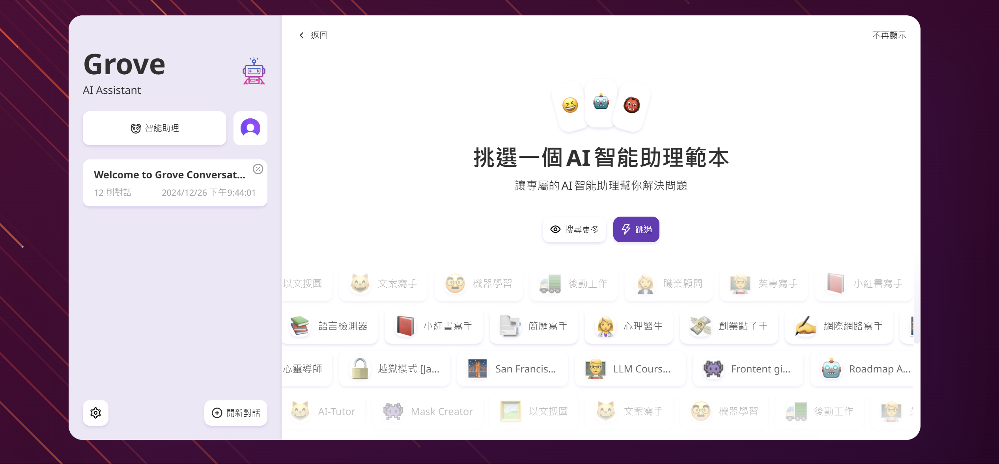
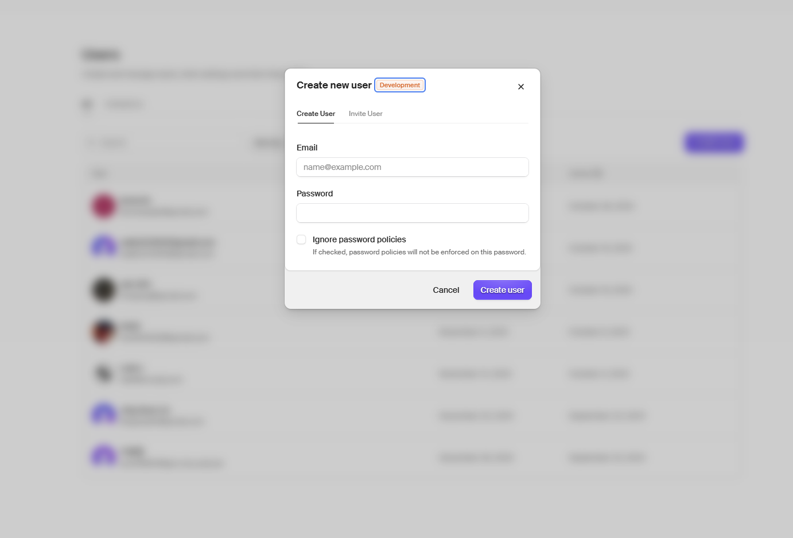

<div align="center">

[英語](./README.en.md)\|[簡体字中国語](./README.zh-CN.md)\|[アラビア語](./README.ar.md)\|[フランス語](./README.fr.md)\|[日本語](./README.ja.md)

</div>
<div align="center">
  <h1>GroveChat</h1>
  <a href='#企業版'>
    
  </a>

  <p>一鍵免費部署你的私人 ChatGPT 網頁應用，支持 GPT3、GPT4 和 Gemini Pro 模型。</p>

  <p>
    <a href="https://grove-chat.vercel.app">GroveChat</a> / 
    <a href="https://grove-chat.vercel.app">企業版</a> / 
    <a href="https://grove-chat.vercel.app">演示 Demo</a> / 
    <a href="https://github.com/robbiedood/grove-chat/issues">反饋 Issues</a>
  </p>

  <a href="https://vercel.com/new/clone?repository-url=https://github.com/robbiedood/grove-chat&env=OPENAI_API_KEY&env=CLERK_SECRET_KEY&env=CLERK_WEBHOOK_SECRET&env=NEXT_PUBLIC_CLERK_PUBLISHABLE_KEY&project-name=grove-chat&repository-name=grove-chat">
    
  </a>
</div>

## 目次

-   [企業版](#企業版)
-   [特徴](#功能特點)
-   [開始使用](#開始使用)
-   [ページアクセスパスワードを設定する](#配置頁面訪問密碼)
-   [環境変数](#環境變量)
-   [ユーザーモデルの設定](#用戶模型設置)
-   [地域開発](#開發)
-   [スクリーンショット](#截圖)
-   [関連プロジェクト](#相關項目)
-   [オープンソース契約](#開源協議)
-   [説明の変更](./CHANGELOG.md)

## 企業版

会社のプライベート展開とカスタマイズのニーズに対応します

-   **ブランドのカスタマイズ**：企業のブランドイメージに合わせたエンタープライズ向けのVI/UI
-   **資源集成**: 数十の AI リソースがエンタープライズ マネージャーによって一元的に構成および管理され、チーム メンバーはすぐにそれらを使用できます。
-   **権限管理**: メンバー権限、リソース権限、ナレッジベース権限は明確に階層化されており、エンタープライズレベルの管理パネルによって統合制御されます。
-   **知識へのアクセス**：企業の内部知識ベースと AI 機能の組み合わせは、一般的な AI よりも企業自身のビジネス ニーズに近いものになります。
-   **セキュリティ監査**：機密性の高い質問を自動的に傍受し、すべての過去の会話記録の追跡をサポートするため、AI が企業の情報セキュリティ規制にも準拠できるようになります。
-   **プライベート展開**: エンタープライズ レベルのプライベート展開。さまざまな主流のプライベート クラウド展開をサポートして、データ セキュリティとプライバシー保護を確保します。
-   **継続的なアップデート**：頻繁に使用され、常に進歩するマルチモダリティやインテリジェンスなどの最先端の機能に対する継続的な更新およびアップグレード サービスを提供します。

エンタープライズ バージョンに関する相談:**空の**


## 特徴

-   ワンクリックで Vercel に無料で導入でき、所要時間は 1 分以内です
-   Linux/Windows/MacOS 用の合理化されたクライアント (~5MB)、今すぐダウンロード
-   自己展開型 LLM と完全に互換性があり、RWKV-Runner または LocalAI との使用を推奨
-   プライバシーを第一に、すべてのデータはブラウザにローカルに保存されます
-   マークダウンのサポート: LaTex、マーメイド、コードの強調表示など。
-   レスポンシブデザイン、ダークモードとPWAをサポート
-   最初の画面はすぐに読み込まれ (約 100kb)、ストリーミング応答をサポートします。
-   v2 の新機能: プロンプト テンプレート (マスク) を使用してチャット ツールを作成、共有、デバッグします
-   チャット履歴を自動的に圧縮して、トークンを保存しながら長時間の会話をサポートします
-   多言語サポート: 英語、簡体字中国語、繁体字中国語、日本語、フランス語、スペイン語、イタリア語、トルコ語、ドイツ語、ベトナム語、ロシア語、チェコ語、韓国語、インドネシア語

## 開始使用

1.  準備をしてください[OpenAI APIキー](https://platform.openai.com/account/api-keys);
2.  ユーザー権限管理として Clerk を使用する[クラーク公式サイト](https://clerk.com/)[設定ファイル](#配置頁面訪問密碼)
3.  右側のボタンをクリックして展開を開始します。[](https://vercel.com/new/clone?repository-url=https://github.com/robbiedood/grove-chat&env=OPENAI_API_KEY&env=CLERK_SECRET_KEY&env=CLERK_WEBHOOK_SECRET&env=NEXT_PUBLIC_CLERK_PUBLISHABLE_KEY&project-name=grove-chat&repository-name=grove-chat)、GitHub アカウントで直接ログインするだけです。忘れずに API キーを入力してください。[ユーザー権限の管理](#配置訪問權限Clerk)店員;
4.  導入が完了したら、使用を開始できます。
5.  （可選）[カスタム ドメイン名をバインドする](https://vercel.com/docs/concepts/projects/domains/add-a-domain): Vercel によって割り当てられたドメイン名 DNS が一部の領域で汚染されています。カスタム ドメイン名をバインドして直接接続してください。

<div align="center">
   


</div>

## ページアクセスパスワードを設定する

> このプロジェクトは、元のプロジェクト NextChat の CODE 環境変数を放棄し、Clerk 管理ページのアクセス パスワードを使用します。
>
> ### ステップ 1: Clerk アカウントにサインアップする
>
> に行く[クラーク公式サイト](https://clerk.com/), アカウントを登録してログインします。ログイン後、クリックしてください**アプリケーションの作成**(アプリケーションのビルド)。


### ステップ 2: ログイン オプションを選択する

有効にする**電子メール**（必要）和**グーグル**(オプション) 以下に示すオプション。


### ステップ 3: API キーを取得する

あなたを見つけてください`NEXT_PUBLIC_CLERK_PUBLISHABLE_KEY`そして`CLERK_SECRET_KEY`。それらを追加します`.env`以下に示すように、ファイルを作成します。

```env
NEXT_PUBLIC_CLERK_PUBLISHABLE_KEY=你的公開金鑰
CLERK_SECRET_KEY=你的密鑰
```


### ステップ 4: 電子メールとパスワードを設定する

に行く**設定 > 電子メール、電話番号、ユーザー名**(\[設定] > \[電子メール、電話、ユーザー名])、有効になっていることを確認します。**電子メール**(電子メール)、**パスワード**(パスワード)と**メール認証コード**(メール認証コード)。


### ステップ 5: 役割と権限を構成する

次の図に示すように、ロールと権限を設定します。


### ステップ 6: 一般設定

に行く**「構成」>「設定」**(\[構成] > \[設定]) を選択し、以下に示すようにオプションを設定します。


### ステップ 7: Webhook を構成する

Webhook エンドポイントをリスニング URL に設定します。クリック**署名の秘密**(署名キー)`CLERK_WEBHOOK_SECRET`に追加します。`.env`アーカイブ内:

```env
CLERK_WEBHOOK_SECRET=你的webhook密鑰
```


### ステップ 8: ユーザーを作成する

必要に応じてユーザー アカウントを作成します。



### ステップ 9: 組織を構築する

組織を設定し、開発者の電子メール アドレスを追加します。役割を次のように設定します**教師**（教師）。

## 複数管理者の Grove アプリケーションを管理する

### ステップ 1: 組織を構築する

左上隅をクリックします**組織の作成**（組織を構築する）。

### ステップ 2: 所有権を譲渡する

に行く**「構成」>「設定」**(\[構成] > \[設定])、クリックします。**所有権の譲渡**（所有権の移転）。新しい所有者を作成したばかりの組織に設定します。


### ステップ 3: ユーザーを追加する

左上隅をクリックします**管理**(管理者) ユーザーを追加し、管理アクセスを許可します。


## 環境変数

> このプロジェクトの構成項目のほとんどは、チュートリアルによって設定されます。[Vercel 環境変数を変更する方法](./docs/vercel-cn.md)。

### `OPENAI_API_KEY`（必須）

OpenAI キー (openai アカウント ページで申請した API キー) は、英語のカンマを使用して複数のキーを区切ります。これにより、これらのキーがランダムにポーリングされます。

### `CLERK_SECRET_KEY`（必須）

店員ユーザー管理

### `CLERK_WEBHOOK_SECRET`（必須）

店員ユーザー管理

### `NEXT_PUBLIC_CLERK_PUBLISHABLE_KEY`（必須）

店員ユーザー管理

### `BASE_URL`（可選）

> デフォルト：`https://api.openai.com`

> 例：`http://your-openai-proxy.com`

OpenAI インターフェイス プロキシ URL。openai インターフェイス プロキシを手動で設定した場合は、このオプションを入力してください。

> SSL 証明書に問題がある場合は、置き換えてください`BASE_URL`的協議設置為 http。

### `OPENAI_ORG_ID`（可選）

指定 OpenAI 中的組織 ID。

### `AZURE_URL`（可選）

> 次のような形状: https&#x3A;//{azure-resource-url}/openai

Azure デプロイメントアドレス。

### `AZURE_API_KEY`（可選）

アズールキー。

### `AZURE_API_VERSION`（可選）

Azure API バージョンは次の場所にあります。[Azureのドキュメント](https://learn.microsoft.com/en-us/azure/ai-services/openai/reference#chat-completions)。

### `GOOGLE_API_KEY`(可選)

Google Gemini プロキー。

### `GOOGLE_URL`(可選)

Google Gemini Pro API URL。

### `ANTHROPIC_API_KEY`(可選)

Anthropic Claude API キー。

### `ANTHROPIC_API_VERSION`(可選)

Anthropic Claude API バージョン。

### `ANTHROPIC_URL`(可選)

Anthropic Claude Api URL。

### `BAIDU_API_KEY`(可選)

百度ファイアキー。

### `BAIDU_SECRET_KEY`(可選)

百度の秘密キー。

### `BAIDU_URL`(可選)

百度 API の URL。

### `BYTEDANCE_API_KEY`(可選)

ByteDance ファイアキー。

### `BYTEDANCE_URL`(可選)

ByteDance API URL。

### `ALIBABA_API_KEY`(可選)

Alibaba Cloud (Qianwen) API キー。

### `ALIBABA_URL`(可選)

Alibaba Cloud (Qianwen) API URL。

### `IFLYTEK_URL`(可選)

iFlytek Spark API URL。

### `IFLYTEK_API_KEY`(可選)

iFlytek Spark API キー。

### `IFLYTEK_API_SECRET`(可選)

iFlytek Spark API シークレット。

### `CHATGLM_API_KEY`(可選)

ChatGLM APIキー。

### `CHATGLM_URL`(可選)

ChatGLM API URL。

### `XAI_API_KEY`(可選)

XAI API キー。

### `XAI_URL`(可選)

こんにちは、アピ・オールです。

### `PERPLEXITY_API_KEY`(可選)

PERPLEXITY API キー。

### `PERPLEXITY_URL`(可選)

PERPLEXITY API URL。

### `MOONSHOT_API_KEY`(可選)

MOONSHOT API キー。

### `MOONSHOT_URL`(可選)

MOONSHOT API URL

### `HIDE_USER_API_KEY`（可選）

ユーザーが自分で API キーを入力しないようにするには、この環境変数を 1 に設定します。

### `DISABLE_GPT4`（可選）

ユーザーに GPT-4 を使用させたくない場合は、この環境変数を 1 に設定してください。

### `ENABLE_BALANCE_QUERY`（可選）

残高照会機能を有効にしたい場合は、この環境変数を 1 に設定するだけです。

### `DISABLE_FAST_LINK`（可選）

リンクからのプレハブ設定の解析を無効にする場合は、この環境変数を 1 に設定します。

### `WHITE_WEBDAV_ENDPOINTS`(可選)

アクセスを許可する WebDAV サービス アドレスを追加する場合は、このオプションを使用できます。形式要件は次のとおりです。

-   各アドレスは完全なエンドポイントである必要があります
    > `https://xxxx/xxx`
-   複数のアドレスへ`,`接続されています

### `CUSTOM_MODELS`（可選）

> 例：`+qwen-7b-chat,+glm-6b,-gpt-3.5-turbo,gpt-4-1106-preview=gpt-4-turbo`増加することを意味します`qwen-7b-chat`そして`glm-6b`モデルリストに追加し、リストから削除します`gpt-3.5-turbo`、そして意志`gpt-4-1106-preview`モデル名は次のように表示されます。`gpt-4-turbo`。  
> 最初にすべてのモデルを無効にしてから、特定のモデルを有効にしたい場合は、次のように使用できます。`-all,+gpt-3.5-turbo`、これは有効にするだけを意味します`gpt-3.5-turbo`。

モデルリストを制御するには、次を使用します。`+`モデルを追加するには、次を使用します`-`モデルを非表示にするには、次を使用します。`模型名=展示名`モデルをカスタマイズするための名前をカンマで区切って表示します。

Azure モードでは、次の使用がサポートされています。`modelName@Azure=deploymentName`モデル名とデプロイメント名(deploy-name)を設定します。

> 例：`+gpt-3.5-turbo@Azure=gpt35`この設定では、`gpt35(Azure)`オプション。  
> Azure モードのみを使用できる場合は、次のように設定します。`-all,+gpt-3.5-turbo@Azure=gpt35`会話のデフォルトの使用を行うことができます`gpt35(Azure)`。

ByteDance モードでは、次の使用をサポートします。`modelName@bytedance=deploymentName`モデル名とデプロイメント名(deploy-name)を設定します。

> 例：`+Doubao-lite-4k@bytedance=ep-xxxxx-xxx`この設定では、`Doubao-lite-4k(ByteDance)`オプション。

### `DEFAULT_MODEL`（可選）

デフォルトのモデルを変更します。

### `DEFAULT_INPUT_TEMPLATE`（可選）

「設定」の「ユーザー入力前処理」構成項目を初期化するために使用されるデフォルトのテンプレートをカスタマイズします。

### `STABILITY_API_KEY`(可選)

安定性 API キー。

### `STABILITY_URL`(可選)

カスタマイズされた安定性 API リクエスト アドレス。

## ユーザーモデルの設定

ログイン

> システムが設定したAPI Keyを、ユーザーの最高権限に応じて使い分けることができます。

未登入

> ログインしていない場合は、プロキシ設定に独自の API キーを入力してゲスト モデルを使用できます。

ログイン後のユーザー役割

> ゲスト

役割の権限はClerkダッシュボードで変更できます

> [クラーク構成チュートリアル](#配置頁面訪問密碼)

Clerk を構成した後、教師権限を持つ教師は Grove Chat の設定ページで組織を直接管理し、アクセス可能なモデルをさらに制御するためにメンバーを招待できます。

### 新しいモデルを追加

[コードファイル](./app/constant.ts)

新しいモデルを追加するモデルのサプライヤーを検索

    const openaiModels = [
      "gpt-3.5-turbo",
      "gpt-3.5-turbo-1106",
      "gpt-3.5-turbo-0125",
      "gpt-4",
      "gpt-4-0613",
      "gpt-4-32k",
      "gpt-4-32k-0613",
      "gpt-4-turbo",
      "gpt-4-turbo-preview",
      "gpt-4o",
      "gpt-4o-2024-05-13",
      "gpt-4o-2024-08-06",
      "gpt-4o-2024-11-20",
      "chatgpt-4o-latest",
      "gpt-4o-mini",
      "gpt-4o-mini-2024-07-18",
      "gpt-4-vision-preview",
      "gpt-4-turbo-2024-04-09",
      "gpt-4-1106-preview",
      "dall-e-3",
      "o1-mini",
      "o1-preview",
    ];

アクセス権の管理 (モデル サプライヤーのモデル リストに含まれている必要があります)

      teacher: [
        "o1-mini",
        "o1-preview",
        "gpt-4o-2024-08-06",
        "gpt-4o-mini",
        "claude-3-sonnet-20240229",
        "claude-3-5-sonnet-20240620",
        "llama-3.1-sonar-small-128k-online",
        "llama-3.1-sonar-large-128k-online",
        "llama-3.1-sonar-huge-128k-online",
        "gemini-1.5-pro-latest",
        "gemini-1.5-flash-latest",
        "moonshot-v1-128k",
        "moonshot-v1-32k",
        "grok-2-1212",
        "grok-2-vision-1212",
      ],

## 開発する

中国本土のユーザーは、このプロジェクトに付属するエージェントを使用して開発を行うことができます。また、他のエージェントのアドレスを自由に選択することもできます。
BASE_URL=<https://b.nextweb.fun/api/proxy>

### 地域開発

1.  プロジェクトのルートディレクトリに新しいものを作成します`.env.local`ファイルに環境変数を入力します。


    OPENAI_API_KEY=<your key here>
    CLERK_SECRET_KEY=<your key here>
    CLERK_WEBHOOK_SECRET=<your key here>
    NEXT_PUBLIC_CLERK_PUBLISHABLE_KEY=<your key here>

2.  Node.js 18 と Yarn をインストールします。詳細については ChatGPT に問い合わせてください。
3.  執行`yarn install && yarn dev`それでおしまい。 ⚠️ 注: このコマンドはローカル開発専用です。デプロイメントには使用しないでください。
4.  ローカルにデプロイする場合は、次を使用します。`yarn install && yarn build && yarn start`コマンドの場合、pm2 を使用してプロセスをデーモン化し、プロセスが強制終了されないようにすることができます。詳細については ChatGPT に問い合わせてください。

### 容器部署

> Docker バージョンは 20 以上である必要があります。そうでない場合は、イメージが見つからないというメッセージが表示されます。

> ⚠️ 注: ほとんどの場合、Docker のバージョンは最新バージョンより 1 ～ 2 日遅れているため、デプロイ後に「更新が存在します」というプロンプトが表示され続けますが、これは正常です。

```shell
docker pull robbiedood/grove-chat

docker run -d -p 3000:3000 \
   -e OPENAI_API_KEY=sk-xxxx \
   -e CLERK_SECRET_KEY=<your key here> \
   -e CLERK_WEBHOOK_SECRET=<your key here> \
   -e NEXT_PUBLIC_CLERK_PUBLISHABLE_KEY=<your key here> \
   robbiedood/grove-chat
```

プロキシを指定することもできます。

```shell
docker run -d -p 3000:3000 \
   -e OPENAI_API_KEY=sk-xxxx \
   -e CLERK_SECRET_KEY=<your key here> \
   -e CLERK_WEBHOOK_SECRET=<your key here> \
   -e NEXT_PUBLIC_CLERK_PUBLISHABLE_KEY=<your key here> \
   --net=host \
   -e PROXY_URL=http://127.0.0.1:7890 \
   robbiedood/grove-chat
```

ローカル エージェントがアカウントとパスワードを必要とする場合は、次のものを使用できます。

```shell
-e PROXY_URL="http://127.0.0.1:7890 user password"
```

他の環境変数を指定する必要がある場合は、上記のコマンドに自分で追加してください。`-e 環境變量=環境變量值`指定すること。

### ローカル展開

コンソールで次のコマンドを実行します。

```shell
bash <(curl -s https://raw.githubusercontent.com/robbiedood/grove-chat/main/scripts/setup.sh)
```

⚠️ 注: インストール中に問題が発生した場合は、Docker デプロイメントを使用してください。

## スクリーンショット

<div style="display: flex; gap: 20px;">
  
</div>

### 関連プロジェクト

-   [ChatGPT-Next-Web](https://github.com/ChatGPTNextWeb/ChatGPT-Next-Web):
    市場のすべての主要な大規模言語モデルをサポートするワンストップの大規模モデル プラットフォーム。

-   [ワンAPI](https://github.com/songquanpeng/one-api): 市場のすべての主流の大規模言語モデルをサポートする、ワンストップの大規模モデル クォータ管理プラットフォーム。

-   [Mr.Ranedeer AI 家庭教師](https://github.com/JushBJJ/Mr.-Ranedeer-AI-Tutor):AI家庭教師

## オープンソース契約

[と](https://opensource.org/license/mit/)
