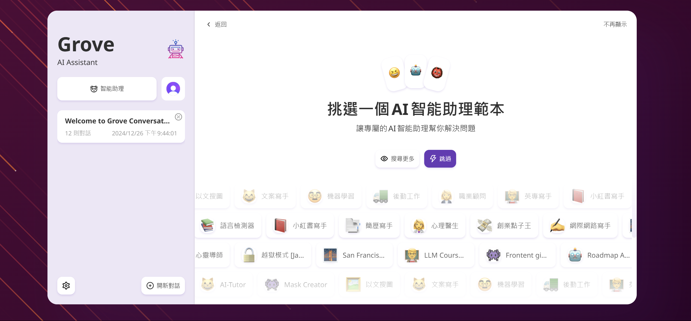
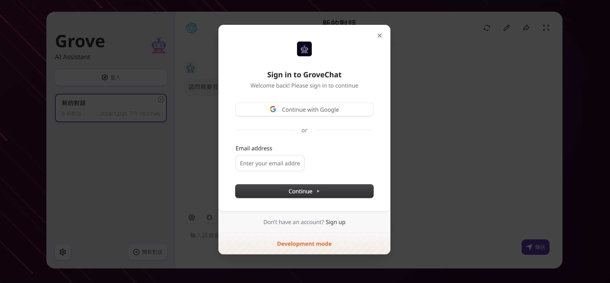
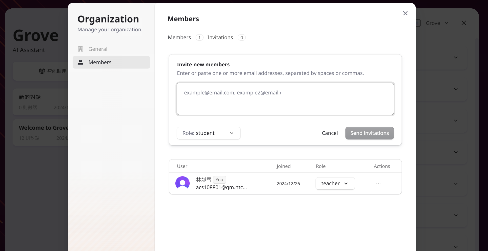
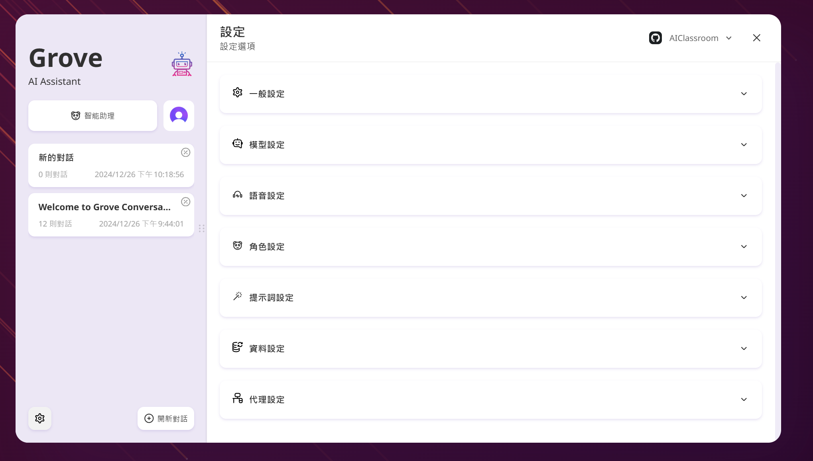
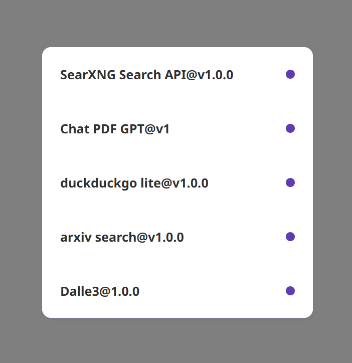

<div align="center">

<a href='#企業版'>
  
</a>

<h1 align="center">GroveChat</h1>

<a href='#企業版'>
  
</a>

一鍵免費部署你的私人 ChatGPT 網頁應用，支持 GPT3、GPT4 和 Gemini Pro 模型。

[格羅夫聊天](https://grove-chat.vercel.app)/[企業版](https://grove-chat.vercel.app)/[演示 Demo](https://grove-chat.vercel.app)/[反饋 Issues](https://github.com/robbiedood/grove-chat/issues)

[](https://vercel.com/new/clone?repository-url=https://github.com/robbiedood/grove-chat&env=OPENAI_API_KEY&env=CLERK_SECRET_KEY&env=CLERK_WEBHOOK_SECRET&env=NEXT_PUBLIC_CLERK_PUBLISHABLE_KEY&project-name=grove-chat&repository-name=grove-chat)

</div>

## 目錄

-   [企業版](#企業版)
-   [功能特點](#功能特點)
-   [開始使用](#開始使用)
-   [配置頁面訪問密碼](#配置頁面訪問密碼)
-   [環境變量](#環境變量)
-   [用戶模型設置](#用戶模型設置)
-   [本地開發](#開發)
-   [截圖](#截圖)
-   [相關項目](#相關項目)
-   [開源協議](#開源協議)

## 企業版

滿足您公司私有化部署和定制需求

-   **品牌客製**：企業量身定制 VI/UI，與企業品牌形象無縫契合
-   **資源集成**：由企業管理人員統一配置和管理數十種 AI 資源，團隊成員開箱即用
-   **權限管理**：成員權限、資源權限、知識庫權限層級分明，企業級 Admin Panel 統一控制
-   **知識接入**：企業內部知識庫與 AI 能力相結合，比通用 AI 更貼近企業自身業務需求
-   **安全審計**：自動攔截敏感提問，支持追溯全部歷史對話記錄，讓 AI 也能遵循企業信息安全規範
-   **私有部署**：企業級私有部署，支持各類主流私有雲部署，確保數據安全和隱私保護
-   **持續更新**：提供多模態、智能體等前沿能力持續更新升級服務，常用常新、持續先進

企業版諮詢:**空的**


## 功能特點

-   在 Vercel 上一鍵免費部署，僅需不到 1 分鐘
-   精簡的客戶端（約 5MB），適用於 Linux/Windows/MacOS，立即下載
-   完全兼容自部署的 LLM，建議搭配 RWKV-Runner 或 LocalAI 使用
-   隱私優先，所有數據均存儲在本地瀏覽器中
-   支持 Markdown：LaTex、mermaid、代碼高亮等
-   響應式設計，支持深色模式和 PWA
-   首屏加載速度快（約 100kb），支持流式響應
-   v2 新功能：使用提示模板（mask）創建、分享和調試你的聊天工具
-   由 awesome-chatgpt-prompts-zh 和 awesome-chatgpt-prompts 提供支援的精彩提示
-   自動壓縮聊天記錄，以支持長對話，同時節省你的 token
-   多語言支持：英語、简体中文、繁體中文、日語、法語、西班牙語、意大利語、土耳其語、德語、越南語、俄語、捷克語、韓語、印尼語

## 開始使用

1.  準備好你的[OpenAI API 金鑰](https://platform.openai.com/account/api-keys);
2.  使用Clerk作為用戶權限管理[Clerk官網](https://clerk.com/)[設定檔](https://github.com/robbiedood/grove-chat/tree/main/docs)
3.  點擊右側按鈕開始部署：[](https://vercel.com/new/clone?repository-url=https://github.com/robbiedood/grove-chat&env=OPENAI_API_KEY&env=CLERK_SECRET_KEY&env=CLERK_WEBHOOK_SECRET&env=NEXT_PUBLIC_CLERK_PUBLISHABLE_KEY&project-name=grove-chat&repository-name=grove-chat)，直接使用 GitHub 賬號登錄即可，記得在環境變量頁填入 API Key 和[用戶權限管理](#配置訪問權限Clerk)文員；
4.  部署完畢後，即可開始使用；
5.  （可選）[綁定自定義域名](https://vercel.com/docs/concepts/projects/domains/add-a-domain)：Vercel 分配的域名 DNS 在某些區域被污染了，綁定自定義域名即可直連。

<div align="center">
   


</div>

## 配置頁面訪問密碼

> 本項目已棄用原專案NextChat的CODE環境變數，並使用Clerk管理頁面訪問密碼。教程：[如何配置Clerk](./docs)。





## 環境變量

> 本項目大多數配置項都通過環境變量來設置，教程：[如何修改 Vercel 環境變量](./docs/vercel-cn.md)。

### `OPENAI_API_KEY`（必填項）

OpenAI 密鑰，你在 openai 賬戶頁面申請的 api key，使用英文逗號隔開多個 key，這樣可以隨機輪詢這些 key。

### `CLERK_SECRET_KEY`（必填項）

Clerk 用戶管理

### `CLERK_WEBHOOK_SECRET`（必填項）

Clerk 用戶管理

### `NEXT_PUBLIC_CLERK_PUBLISHABLE_KEY`（必填項）

Clerk 用戶管理

### `BASE_URL`（可選）

> 默認:`https://api.openai.com`

> 範例:`http://your-openai-proxy.com`

OpenAI 接口代理 URL，如果你手動配置了 openai 接口代理，請填寫此選項。

> 如果遇到 ssl 證書問題，請將`BASE_URL`的協議設置為 http。

### `OPENAI_ORG_ID`（可選）

指定 OpenAI 中的組織 ID。

### `AZURE_URL`（可選）

> 形態如：https&#x3A;//{azure-resource-url}/openai

Azure 部署位址。

### `AZURE_API_KEY`（可選）

Azure 密鑰。

### `AZURE_API_VERSION`（可選）

Azure Api 版本，你可以在這裡找到：[Azure 文檔](https://learn.microsoft.com/en-us/azure/ai-services/openai/reference#chat-completions)。

### `GOOGLE_API_KEY`(可選)

Google Gemini Pro 密鑰。

### `GOOGLE_URL`(可選)

Google Gemini Pro Api 網址。

### `ANTHROPIC_API_KEY`(可選)

人類克勞德 Api 密鑰。

### `ANTHROPIC_API_VERSION`(可選)

Anthropic Claude Api 版本。

### `ANTHROPIC_URL`(可選)

人類克勞德 Api 網址。

### `BAIDU_API_KEY`(可選)

百度火鍵。

### `BAIDU_SECRET_KEY`(可選)

百度秘鑰。

### `BAIDU_URL`(可選)

百度API位址。

### `BYTEDANCE_API_KEY`(可選)

位元組跳動火鍵。

### `BYTEDANCE_URL`(可選)

位元組跳動API位址。

### `ALIBABA_API_KEY`(可選)

阿里雲（千問）Api Key。

### `ALIBABA_URL`(可選)

阿里雲（千問）Api Url。

### `IFLYTEK_URL`(可選)

訊飛星火 Api Url。

### `IFLYTEK_API_KEY`(可選)

訊飛星火 Api Key。

### `IFLYTEK_API_SECRET`(可選)

訊飛星火 Api Secret。

### `CHATGLM_API_KEY`(可選)

ChatGLM Api 金鑰。

### `CHATGLM_URL`(可選)

ChatGLM Api 網址。

### `XAI_API_KEY`(可選)

XAI API 金鑰。

### `XAI_URL`(可選)

嗨，阿皮奧爾。

### `PERPLEXITY_API_KEY`(可選)

PERPLEXITY Api 金鑰。

### `PERPLEXITY_URL`(可選)

困惑 Api 網址。

### `MOONSHOT_API_KEY`(可選)

MOONSHOT Api 金鑰。

### `MOONSHOT_URL`(可選)

MOONSHOT API 網址

### `HIDE_USER_API_KEY`（可選）

如果你不想讓用戶自行填入 API Key，將此環境變量設置為 1 即可。

### `DISABLE_GPT4`（可選）

如果你不想讓用戶使用 GPT-4，將此環境變量設置為 1 即可。

### `ENABLE_BALANCE_QUERY`（可選）

如果你想啟用餘額查詢功能，將此環境變量設置為 1 即可。

### `DISABLE_FAST_LINK`（可選）

如果你想禁用從鏈接解析預製設置，將此環境變量設置為 1 即可。

### `WHITE_WEBDAV_ENDPOINTS`(可選)

如果你想增加允許訪問的 WebDAV 服務地址，可以使用該選項，格式要求：

-   每一個地址必須是一個完整的 endpoint
    > `https://xxxx/xxx`
-   多個地址以`,`相連

### `CUSTOM_MODELS`（可選）

> 範例：`+qwen-7b-chat,+glm-6b,-gpt-3.5-turbo,gpt-4-1106-preview=gpt-4-turbo`表示增加`qwen-7b-chat`和`glm-6b`到模型列表，而從列表中刪除`gpt-3.5-turbo`，並將`gpt-4-1106-preview`模型名字展示為`gpt-4-turbo`。  
> 如果你想先禁用所有模型，再啟用指定模型，可以使用`-all,+gpt-3.5-turbo`，則表示僅啟用`gpt-3.5-turbo`。

用來控制模型列表，使用`+`增加一個模型，使用`-`來隱藏一個模型，使用`模型名=展示名`來自定義模型的展示名，用英文逗號隔開。

在 Azure 的模式下，支援使用`modelName@Azure=deploymentName`的方式配置模型名稱和部署名稱（deploy-name）。

> 範例：`+gpt-3.5-turbo@Azure=gpt35`這個配置會在模型列表顯示一個`gpt35(Azure)`的選項。  
> 如果你只能使用 Azure 模式，那麼設置`-all,+gpt-3.5-turbo@Azure=gpt35`則可以讓對話的默認使用`gpt35(Azure)`。

在 ByteDance 的模式下，支援使用`modelName@bytedance=deploymentName`的方式配置模型名稱和部署名稱（deploy-name）。

> 範例:`+Doubao-lite-4k@bytedance=ep-xxxxx-xxx`這個配置會在模型列表顯示一個`Doubao-lite-4k(ByteDance)`的選項。

### `DEFAULT_MODEL`（可選）

更改默認模型。

### `DEFAULT_INPUT_TEMPLATE`（可選）

自定義默認的 template，用於初始化『設置』中的『用戶輸入預處理』配置項。

### `STABILITY_API_KEY`(可選)

Stability API 密鑰。

### `STABILITY_URL`(可選)

自定義的 Stability API 請求地址。

## 用戶模型設置

登入

> 可根據用戶最高權限使用系統設置的API Key。

未登入

> 如果未登入可在代理設定中填入自己的API Key使用guest模型。

登入後用戶角色

> 客人

可在Clerk dashboard中更改角色權限

> [Clerk配置教學](https://github.com/robbiedood/grove-chat/tree/main/docs)

### 新增模型

[程式碼文件 app/constant.ts](https://github.com/robbiedood/grove-chat/blob/pbooks/app/constant.ts)

找到模型供應商添加新模型

    const openaiModels = [
      "gpt-3.5-turbo",
      "gpt-3.5-turbo-1106",
      "gpt-3.5-turbo-0125",
      "gpt-4",
      "gpt-4-0613",
      "gpt-4-32k",
      "gpt-4-32k-0613",
      "gpt-4-turbo",
      "gpt-4-turbo-preview",
      "gpt-4o",
      "gpt-4o-2024-05-13",
      "gpt-4o-2024-08-06",
      "gpt-4o-2024-11-20",
      "chatgpt-4o-latest",
      "gpt-4o-mini",
      "gpt-4o-mini-2024-07-18",
      "gpt-4-vision-preview",
      "gpt-4-turbo-2024-04-09",
      "gpt-4-1106-preview",
      "dall-e-3",
      "o1-mini",
      "o1-preview",
    ];

管理存取權限(須在模型供應商的模型列表中)

      teacher: [
        "o1-mini",
        "o1-preview",
        "gpt-4o-2024-08-06",
        "gpt-4o-mini",
        "claude-3-sonnet-20240229",
        "claude-3-5-sonnet-20240620",
        "llama-3.1-sonar-small-128k-online",
        "llama-3.1-sonar-large-128k-online",
        "llama-3.1-sonar-huge-128k-online",
        "gemini-1.5-pro-latest",
        "gemini-1.5-flash-latest",
        "moonshot-v1-128k",
        "moonshot-v1-32k",
        "grok-2-1212",
        "grok-2-vision-1212",
      ],

## 開發

# 中國大陸用戶，可以使用本項目自帶的代理進行開發，你也可以自由選擇其他代理地址

BASE_URL=<https://b.nextweb.fun/api/proxy>

### 本地開發

1.  在項目根目錄新建一個`.env.local`文件，裡面填入環境變量：


    OPENAI_API_KEY=<your key here>
    CLERK_SECRET_KEY=<your key here>
    CLERK_WEBHOOK_SECRET=<your key here>
    NEXT_PUBLIC_CLERK_PUBLISHABLE_KEY=<your key here>

2.  安裝 Node.js 18 和 Yarn，具體細節請詢問 ChatGPT；
3.  執行`yarn install && yarn dev`即可。⚠️ 注意：此命令僅用於本地開發，不要用於部署！
4.  如果你想本地部署，請使用`yarn install && yarn build && yarn start`命令，你可以配合 pm2 來守護進程，防止被殺死，詳情詢問 ChatGPT。

### 容器部署

> Docker 版本需要在 20 及其以上，否則會提示找不到鏡像。

> ⚠️ 注意：Docker 版本在大多數時間都會落後最新的版本 1 到 2 天，所以部署後會持續出現“存在更新”的提示，屬於正常現象。

```shell
docker pull robbiedood/grove-chat

docker run -d -p 3000:3000 \
   -e OPENAI_API_KEY=sk-xxxx \
   -e CLERK_SECRET_KEY=<your key here> \
   -e CLERK_WEBHOOK_SECRET=<your key here> \
   -e NEXT_PUBLIC_CLERK_PUBLISHABLE_KEY=<your key here> \
   robbiedood/grove-chat
```

你也可以指定 proxy：

```shell
docker run -d -p 3000:3000 \
   -e OPENAI_API_KEY=sk-xxxx \
   -e CLERK_SECRET_KEY=<your key here> \
   -e CLERK_WEBHOOK_SECRET=<your key here> \
   -e NEXT_PUBLIC_CLERK_PUBLISHABLE_KEY=<your key here> \
   --net=host \
   -e PROXY_URL=http://127.0.0.1:7890 \
   robbiedood/grove-chat
```

如果你的本地代理需要帳號密碼，可以使用：

```shell
-e PROXY_URL="http://127.0.0.1:7890 user password"
```

如果你需要指定其他環境變量，請自行在上述命令中增加`-e 環境變量=環境變量值`來指定。

### 本地部署

在控制台運行下方命令：

```shell
bash <(curl -s https://raw.githubusercontent.com/robbiedood/grove-chat/main/scripts/setup.sh)
```

⚠️ 注意：如果你安裝過程中遇到了問題，請使用 Docker 部署。

## 截圖






### 相關項目

-   [ChatGPT-Next-Web](https://github.com/ChatGPTNextWeb/ChatGPT-Next-Web):
    一站式大模型平台，支持市面上所有主流大語言模型。

-   [單一API](https://github.com/songquanpeng/one-api): 一站式大模型額度管理平台，支持市面上所有主流大語言模型。

-   [Mr.-Ranedeer AI導師](https://github.com/JushBJJ/Mr.-Ranedeer-AI-Tutor):AI導師

## 開源協議

[和](https://opensource.org/license/mit/)
